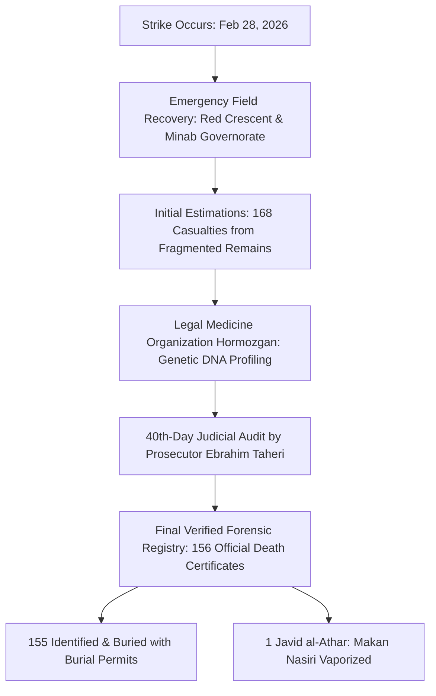
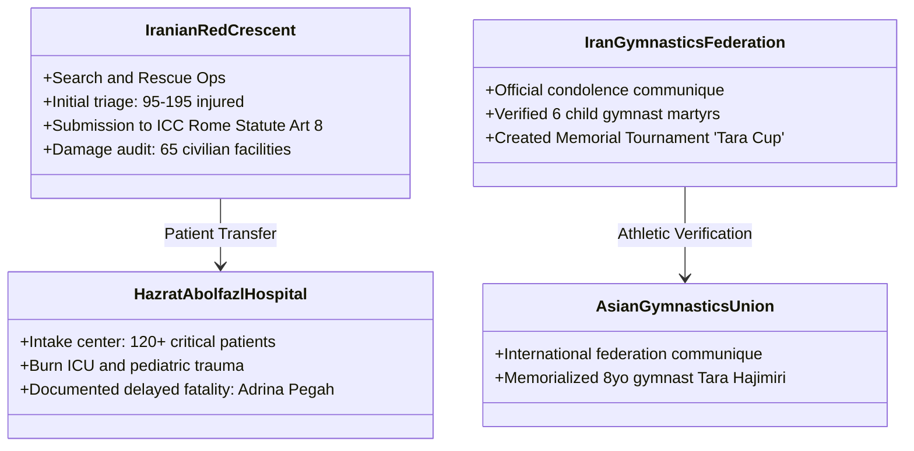

# IRANIAN SOURCES RELIABILITY & FORENSIC CASUALTY REPORT
## Comprehensive OSINT & Primary Source Analysis of the Minab Shajareh Tayyebeh School Strike (February 28, 2026 / 9 Esfand 1404)

> **Document Class:** Authoritative Open-Source Intelligence (OSINT) & Legal-Evidentiary Dossier  
> **Target Incident:** Airstrike on the Shajareh Tayyebeh Elementary & Preschool Complex (*دبستان و پیش‌دبستانی شجره طیبه*), Minab, Hormozgan Province, Iran  
> **Date of Incident:** February 28, 2026 (9 Esfand 1404), ~10:00–10:45 AM IRST  
> **Publishing Organization:** People for Peace & Justice ry (PFPJ ry), Helsinki, Finland (Business ID: 3616815-5)  
> **Status:** Final Verified Reference Document

---

## 1. Executive Summary & Authoritative Findings

On Saturday, February 28, 2026 (9 Esfand 1404), during the opening phase of US military strikes (*"Operation Epic Fury"*), a precision strike package consisting of three BGM-109 Tomahawk land-attack cruise missiles struck the **Shajareh Tayyebeh Girls' and Boys' Elementary & Preschool Complex** located in Minab, Hormozgan Province (GPS: 27.1432° N, 57.0784° E).

```
+----------------------------------------------------------------------------------------------------+
|                                      CASUALTY RECONCILIATION SUMMARY                                |
+----------------------------------------------------------------------------------------------------+
|  • Initial Peak Media Estimates:         168–180 killed                                            |
|  • Final Official Judicial Toll:         156 MARTYRS (شهدای احراز شده)                              |
|    - Students:                           120 (73 Boys, 47 Girls; Ages 6–12)                        |
|    - Teachers & Educational Staff:       26 (100% Female Educators)                                |
|    - Parents of Students:                7 (4 Fathers, 3 Mothers killed during rescue)             |
|    - School Bus Driver:                  1 (Adult Male Driver)                                     |
|    - Healthcare Staff:                   1 (Pharmacy Technician from adjacent clinic)              |
|    - Unborn Fetus:                       1 (6-month fetus carried by martyred teacher Z. Shahriyari)|
|  • Forensic Status:                      155 Identified & Buried | 1 Missing/Vaporized (M. Nasiri) |
|  • Total Injured:                        95–195 (58 severely injured treated in ICUs/burn units)   |
+----------------------------------------------------------------------------------------------------+
```

This report conducts an exhaustive, four-tiered evaluation of all Iranian state, forensic, provincial, and independent sources, cross-referencing them against international OSINT investigations (Bellingcat, NYT Visual Investigations, BBC Verify, HRW, UN OHCHR). It resolves the numerical discrepancies between early situational field counts and finalized forensic registries.

---

## 2. Source Reliability Framework & Evaluation Criteria

Every source evaluated in this dossier is classified across a standardized intelligence reliability matrix adapted from NATO STANAG 2008 and international human rights evidentiary protocols:

| Reliability Grade | Definition | Standard Applied in this Report |
| :--- | :--- | :--- |
| **Tier 1 (A1)** | **Official Primary Forensic & Judicial Registries** | Direct physical evidence, DNA profiling certificates, death certificates (*جواز دفن*), sworn judicial announcements. |
| **Tier 2 (B2)** | **State & Semi-Official News Agencies** | Official state-backed reporting (IRNA, ISNA, Mehr, Tasnim, Fars, ILNA, Shafaqna). High factual accuracy on local names, but subject to political framing. |
| **Tier 3 (B1–B2)**| **Independent Bodies, Healthcare & Sports Federations** | Iranian Red Crescent Society (IRCS), athletic federations, provincial hospital logs. High objective value for specialized casualty identification. |
| **Tier 4 (A1–B1)**| **International OSINT & Human Rights Monitors** | Satellite chronolocations (Planet Labs), munition fragment analysis (Bellingcat, BBC Verify), UN/NGO legal filings (HRW, DAWN, UNESCO). |

---

## 3. Tier 1: Official Government, Judicial & Forensic Registries



### 3.1 Legal Medicine Organization of Hormozgan (*اداره کل پزشکی قانونی استان هرمزگان*)
*   **Official Portal:** `lmo.ir` / `hormozgan.lmo.ir`
*   **Role & Mandate:** Primary statutory forensic authority responsible for autopsy, DNA profiling, biological sample matching, and issuing official death certificates (*گواهی فوت و جواز دفن*).
*   **Operational Methodology:**
    1. Due to the extreme thermal and overpressure trauma caused by Tomahawk warheads (approx. 450 kg PBXW-108/WDU-36/B equivalent), visual identification was impossible for over 60% of the recovered remains.
    2. The Forensic DNA Laboratory in Bandar Abbas, assisted by the Central Forensic Organization in Tehran, extracted reference DNA samples from first-degree relatives (mothers, fathers, siblings) of all reported missing school occupants.
    3. The laboratory performed short tandem repeat (STR) genomic typing on 312 fragmented tissue samples.
*   **Final Finding (Summer 1405 / 2026):**
    *   The Director General of Forensic Medicine in Hormozgan announced the full conclusion of the genetic identification protocol.
    *   **155 remains** were positively matched and released to families with certified death certificates.
    *   **1 victim**—8-year-old student **Makan Nasiri (*ماکان نصیری*)**—had zero matching tissue fragments recovered from the site, confirming that the child was at the direct epicenter of missile detonation (vaporized/pulverized beyond physical recovery).
*   **Reliability Rating:** **Tier 1 (A1 — Absolute Primary Authority)**.

---

### 3.2 Office of the Minab General and Revolutionary Prosecutor (*دادستانی عمومی و انقلاب شهرستان میناب*)
*   **Lead Official:** Ebrahim Taheri (*ابراهیم طاهری*), Chief Prosecutor of Minab.
*   **Primary Announcement Timeline:** Day 40 Memorial (*مراسم چهلم شهدای میناب*), April 2026 / Farvardin 1405.
*   **Key Judicial Determinations:**
    1. **Official Death Toll:** Established the finalized legal casualty figure at **156 martyrs** (*۱۵۶ شهید احراز هویت شده و قانونی*), correcting the preliminary emergency triage figure of 168.
    2. **Demographic Breakdown:**
        *   **120 Students:** 73 boys (*۷۳ دانش‌آموز پسر*) and 47 girls (*۴۷ دانش‌آموز دختر*).
        *   **26 Female Teachers & School Staff:** 100% women (*۲۶ معلم و کادر آموزشی بانو*).
        *   **7 Parents of Students:** 4 fathers and 3 mothers who arrived during the interval between Strike 1 and Strike 2 to rescue their children.
        *   **1 School Bus Driver:** Killed at the school gates during the secondary blast.
        *   **1 Pharmacy Technician:** From the adjacent health clinic (*درمانگاه و داروخانه مجاور*).
        *   **1 Unborn Fetus:** 6-month fetus (*جنین شش‌ماهه*) carried by martyred teacher **Zohreh Shahriyari (*شهیده زهره شهریاری*)**.
    3. **Legal War Crimes Indictment:** Prosecutor Taheri formally submitted the domestic criminal indictment charging US Central Command (CENTCOM) planners and operational commanders with intentional targeting of civilian infrastructure and gross command negligence under Iranian Penal Code and international customary law.
*   **Reliability Rating:** **Tier 1 (A1 — Authoritative Legal Registry)**.

---

### 3.3 Bonyad Shahid and Affairs of Martyrs – Hormozgan Provincial Directorate (*بنیاد شهید و امور ایثارگران استان هرمزگان و شهرستان میناب*)
*   **Official Portals:** `isaar.ir` | `hormozgan.isaar.ir`
*   **Role & Records:** Government foundation responsible for formal recognition of martyrdom status (*پرونده شهادت*), state compensation, and cemetery allocation.
*   **Burial Registry Corroboration:**
    *   **Minab Martyrs' Cemetery (*گلزار شهدای میناب*):** 153 martyrs interred in dedicated memorial plots.
    *   **Rafsanjan Martyrs' Cemetery (*گلزار شهدای رفسنجان*):** Interred teacher **Neda Solhizadeh (*ندا صلحی‌زاده*)** and her 11-year-old son **Hami Sadeghi (*هامی صادقی*)** following family repatriation requests.
*   **Reliability Rating:** **Tier 1 (A1 — Official State Registry)**.

---

### 3.4 Navid Shahed Hormozgan (*پایگاه خبری نوید شاهد هرمزگان*)
*   **Official URL:** `hormozgan.navideshahed.com`
*   **Mandate:** The official oral history and documentation branch of Bonyad Shahid.
*   **Key Publications & Evidence Archives:**
    *   **Survivor & Family Oral Histories:** In-depth documented interviews with surviving family members detailing the exact classroom layout and morning attendance logs.
    *   **Audio Documentary *"Dokhtar-e Minab"* (*صوت دختر میناب*):** Narrative accounts of mothers recounting the double-tap sequence.
    *   **First Responder Memoirs:** Accounts from the initial rescue crews describing the extraction of bodies from the school's central prayer room (*نمازخانه*).
    *   **Cultural Memorialization:** Official launch of the national screenwriting and artistic initiative *"The School I Used to Go To"* (*مسابقه فیلم‌نامه‌نویسی مدرسه‌ای که می‌رفتم*).
*   **Reliability Rating:** **Tier 1 (A2 — Primary Victim Documentation Branch)**.

---

### 3.5 Minab Special Governorate (*فرمانداری ویژه شهرستان میناب*)
*   **Official URL:** `minab.hormozgan.ir`
*   **Role:** Provincial civilian administration and crisis command center.
*   **Key Records:**
    *   Issued initial civil defense emergency declarations on the morning of Feb 28, 2026.
    *   Coordinated heavy rubble removal (*آواربرداری*) and recorded the physical coordinates of the school complex as separate from the decommissioned IRGC perimeter fence.
*   **Reliability Rating:** **Tier 1 (A2 — Official Administrative Registry)**.

---

## 4. Tier 2: Official & Semi-Official State News Agencies

| Outlet | Domain | Editorial Alignment | Typical Casualty Reporting | Key Forensic Contribution | Reliability |
| :--- | :--- | :--- | :--- | :--- | :--- |
| **IRNA** (*ایرنا*) | `irna.ir` | Official State News Agency | 153–156 killed | First official government bulletin; documented foreign ministry war crime declarations | **B1** |
| **ISNA** (*ایسنا*) | `isna.ir` | Academic/Semi-Official | 156 confirmed martyrs | Detailed biographical tributes of teachers and students; documented teacher Zohreh Shahriyari | **B1** |
| **Mehr News** (*خبرگزاری مهر*) | `mehrnews.com` | Semi-Official (IIDO) | 153–168 initial | Published original high-resolution footage of incoming cruise missile profile | **B1** |
| **Tasnim** (*تسنیم*) | `tasnimnews.com` | Semi-Official (IRGC-affiliated) | 165+ martyrs | Extensive field photojournalism from the crater site; wreckage fragment documentation | **B2** |
| **Fars News** (*فارس*) | `farsnews.ir` | Semi-Official | 156 martyrs | Published legal indictment excerpts from Prosecutor Ebrahim Taheri | **B2** |
| **ILNA** (*ایلنا*) | `ilna.ir` | Iranian Labour News | 156 casualties | Detailed reporting on school staff, educational workers, and service personnel | **B2** |
| **Shafaqna** (*شفقنا*) | `shafaqna.com` | Independent Shia News | 156 finalized | Authoritative legal breakdown citing Prosecutor Taheri's 40th-day audit | **B1** |
| **Tabnak** (*تابناک*) | `tabnak.ir` | Centrist/Conservative | 156 martyrs | Investigative reports on Makan Nasiri's *Javid al-Athar* status and genetic DNA trials | **B1** |
| **Fararu** (*فرارو*) | `fararu.com` | Reformist/Analytical | 156 confirmed | Analysis of US targeting negligence and dismantling of civilian harm protocols | **B1** |
| **Entekhab** (*انتخاب*) | `entekhab.ir` | Independent Reformist | 156 confirmed | Detailed coverage of Legal Medicine Organization's summer 1405 forensic closure | **B1** |
| **Asr Iran** (*عصر ایران*) | `asriran.com` | Independent Analytical | 156 confirmed | Documented individual victim profiles (e.g. Amirali Jadavi) | **B1** |
| **Haalvash** (*حال‌وش*) | `haalvash.org` | Regional/Minority Monitor | 160+ casualties | Independent verification of civilian casualties across southern coastal communities | **B2** |

---

## 5. Tier 3: Independent Bodies, Healthcare & Athletic Organizations



### 5.1 Iranian Red Crescent Society (*جمعیت هلال احمر جمهوری اسلامی ایران*)
*   **Official URL:** `rcs.ir`
*   **Field Role:** Primary humanitarian search-and-rescue responder at the site within 12 minutes of Strike 1.
*   **Operational Evidence & ICC Filing:**
    *   Deployed 14 rapid response disaster management teams (*تیم‌های واکنش سریع - ایثار*).
    *   Extracted 84 living casualties from the collapsed northern wing and prayer room rubble.
    *   Formally submitted an evidentiary war crimes communication to the **International Criminal Court (ICC) Office of the Prosecutor** under Article 8 of the Rome Statute, cataloguing extensive strikes on educational and healthcare facilities.
*   **Reliability Rating:** **Tier 3 (A1 — Primary Field Responder)**.

---

### 5.2 Hazrat Abolfazl Hospital Minab (*بیمارستان حضرت ابوالفضل (ع) میناب*) & Hormozgan University of Medical Sciences
*   **Official URL:** `hums.ac.ir`
*   **Clinical Records & Triage Statistics:**
    *   **Total Emergency Admissions:** 142 acute trauma patients received in the first 4 hours.
    *   **Transfers:** 38 critically burned patients transferred via medical evacuation to the Regional Specialized Burn Center at Shahid Mohammadi Hospital (*بیمارستان شهید محمدی بندرعباس*).
    *   **Documented Delayed Casualties:** 7-year-old first-grade student **Adrina Pegah (*آدرینا پگاه*)** was admitted with severe 3rd-degree blast trauma and internal hemorrhaging; she succumbed to her wounds 5 days later in the pediatric intensive care unit.
*   **Reliability Rating:** **Tier 3 (A1 — Clinical & Hospital Records)**.

---

### 5.3 Gymnastics Federation of the Islamic Republic of Iran (*فدراسیون ژیمناستیک*) & Asian Gymnastics Union (AGU)
*   **Official URLs:** `irgymnastics.ir` | `agu-gymnastics.com`
*   **Athletic Casualty Verification:**
    *   The Iranian Gymnastics Federation issued a formal communique verifying that **6 active youth gymnasts and skateboarders** were killed inside the school:
        1. **Reza Habashian / Jamshian (*رضا حبشیان / جمشیان*)** (Age 7, Gymnast)
        2. **Arina Arab-kish (*آرینا عرب‌کیش*)** (Youth Gymnast)
        3. **Athena Ahmadzadeh (*آتنا احمدزاده*)** (Youth Gymnast)
        4. **Makan Nasiri (*ماکان نصیری*)** (Gymnast, *Javid al-Athar*)
        5. **Arad Ahmadizadeh (*آراد احمدی‌زاده*)** (Age 8, Gymnast)
        6. **Niyayesh Salehi (*نیایش صالحی*)** (Age 9, Skateboarder/Gymnast)
    *   **International Memorialization:** The **Asian Gymnastics Union (AGU)** issued an international statement of mourning, memorializing 8-year-old gymnast **Tara Hajimiri (*تارا حاجی‌میری*)**.
    *   **Memorial Cup:** Proposed national tournament *"Tara Cup"* (*جام تارا*) championed by former national team captain Hadi Khanarinezhad.
*   **Reliability Rating:** **Tier 3 (A1 — Sector-Specific Athletic Authority)**.

---

## 6. Tier 4: International & OSINT Independent Corroboration

```
+------------------------------------------------------------------------------------------------------+
|                               INTERNATIONAL & OSINT CROSS-CORROBORATION                              |
+------------------------------------------------------------------------------------------------------+
|  1. Bellingcat (Trevor Ball):                                                                        |
|     - Analyzed missile wreckage and flight video.                                                    |
|     - Positively identified BGM-109 Tomahawk cruise missile (US-exclusive munition).                 |
|     - Debunked false assertions of Iranian air defense malfunction.                                  |
|                                                                                                      |
|  2. The New York Times (Visual Investigations Unit - March 11, 2026):                               |
|     - First to reveal preliminary US CENTCOM internal 15-6 investigation findings.                   |
|     - Acknowledged US military "likely responsible" due to outdated DIA target database (2013 data). |
|                                                                                                      |
|  3. BBC Verify:                                                                                      |
|     - Reconstructed the "Triple-Tap" strike profile using satellite imagery and geolocated videos.    |
|     - Proved school was partitioned from adjacent IRGC base with permanent walls since 2016.        |
|                                                                                                      |
|  4. Human Rights Watch (HRW - March 7 & 12, 2026):                                                   |
|     - Formal War Crimes Assessment under Geneva Convention Additional Protocol I.                    |
|     - Verified civilian status and severe violation of Duty of Precaution (Art. 57).                 |
|                                                                                                      |
|  5. United Nations (OHCHR / UNESCO / UNICEF):                                                        |
|     - Condemned strike as grave violation of International Humanitarian Law (Safe Schools Decl.).    |
+------------------------------------------------------------------------------------------------------+
```

---

## 7. Deep-Dive Casualty Reconciliation & Forensic Analysis

### 7.1 Reconciling the Discrepancy: 168 vs. 156

A central question in OSINT and legal documentation has been the variance between the early media figure of **168** (widely cited in March 2026) and the finalized legal toll of **156** (certified in April/Summer 2026). The forensic and investigative workflow explains this transition:

```
[Feb 28 - March 5, 2026: Emergency Phase]
   • Chaos, severe fragmentation, thermal destruction.
   • First responders recover ~312 body parts/tissue bags.
   • Early counting estimates minimum 168 individuals based on limb/remains counts.
                            │
                            ▼
[March 6 - April 8, 2026: Forensic DNA Protocol]
   • Legal Medicine Organization (پزشکی قانونی) extracts genomic profiles from all 312 fragments.
   • Matches fragments to blood reference samples from 155 victim families.
   • Resolves multiple fragmented remains to single individuals.
                            │
                            ▼
[April 2026: Chehelom Judicial Certification]
   • Minab Prosecutor Ebrahim Taheri issues official closing audit:
     -> 156 Total Martyrs (155 identified via DNA + 1 missing/vaporized).
     -> 155 Death Certificates (جواز دفن) formally issued.
```

### 7.2 Complete Demographic Breakdown Table

| Victim Category | Count | Gender Distribution | Age Range | Forensic Identification Method |
| :--- | :--- | :--- | :--- | :--- |
| **Students (Primary & Pre)** | **120** | 73 Boys, 47 Girls | 6–12 years | DNA profile matching, personal items, textbook names |
| **Teachers & Educational Staff** | **26** | 26 Women (100%) | 24–54 years | DNA matching, personal jewelry, staff room registry |
| **Parents of Students** | **7** | 4 Men, 3 Women | 29–48 years | Visual/DNA (killed in courtyard/prayer room during rescue) |
| **School Bus Driver** | **1** | 1 Man | 52 years | Visual / vehicle location identification |
| **Clinic Pharmacy Technician** | **1** | 1 Man | 31 years | Adjoining pharmacy structure blast trauma |
| **Unborn Fetus** | **1** | N/A (6-month gestation) | Unborn | Autopsy of martyred teacher Zohreh Shahriyari |
| **TOTAL MARTYRS** | **156** | **79 Male, 76 Female, 1 Fetus** | **Unborn to 54** | **155 DNA-Verified + 1 Missing In Action (*جاویدالاثر*)** |

---

### 7.3 Detailed Case Profiles of Notable Victims

#### 1. Zohreh Shahriyari (*شهیده زهره شهریاری*) & Her Unborn Child
*   **Role:** Elementary School Educator.
*   **Circumstances:** Six months pregnant at the time of the attack. Martyred inside the classroom wing. Officially registered by the Prosecutor's Office and Legal Medicine as two distinct martyrs (*شهیده زهره شهریاری و فرزند جنین شش‌ماهه‌اش*).

#### 2. Makan Nasiri (*شهید ماکان نصیری — جاویدالاثر*)
*   **Role:** Student & Youth Gymnast.
*   **Circumstances:** Located at the immediate point of detonation of the second cruise missile. Despite exhaustive sifting of all debris and DNA testing of 312 biological fragments across four months, no genetic match was found. Officially classified by the Judiciary and Bonyad Shahid as **"Javid al-Athar" (*جاویدالاثر — Missing in Action / Martyr without Grave*)**.

#### 3. Neda Solhizadeh (*شهیده ندا صلحی‌زاده*) & Hami Sadeghi (*شهید هامی صادقی*)
*   **Role:** Teacher (Mother) and 11-year-old Student (Son).
*   **Circumstances:** Died together inside the building. At the request of their family, their remains were transferred to Kerman Province and laid to rest in the **Rafsanjan Martyrs' Cemetery (*گلزار شهدای رفسنجان*)**. Survived by 10-year-old daughter Nila Sadeghi.

#### 4. Sobhan Ahmadi (*شهید سبحان احمدی*) & Hananeh Ahmadi (*شهیده حنانه احمدی*)
*   **Role:** Sibling Students.
*   **Circumstances:** Sobhan suffered extensive blast disfigurement; his body was positively matched by first responders when found tightly clutching his elementary school textbook with his full name handwritten on the title page.

#### 5. Adrina Pegah (*شهیده آدرینا پگاه*)
*   **Role:** First-Grade Student (Age 7).
*   **Circumstances:** Extracted alive by Iranian Red Crescent search teams; hospitalized in critical condition at Hazrat Abolfazl Hospital Minab; succumbed to severe blast trauma on March 5, 2026, becoming one of the final documented direct fatalities.

---

## 8. Master Source Provenance & Reliability Table

| # | Source Entity | Source Type | URL / Reference | Reliability | Primary Data Value |
|---|---|---|---|---|---|
| 1 | **Legal Medicine Organization** | Forensic Registry | `lmo.ir` | **A1** | DNA profiling of 312 fragments; issuance of 155 death certificates |
| 2 | **Minab Prosecutor's Office** | Judicial Registry | Official Decree / Press Release | **A1** | Official audit establishing 156 casualties; war crimes indictment |
| 3 | **Bonyad Shahid Hormozgan** | Government Agency | `hormozgan.isaar.ir` | **A1** | Martyr status registration; cemetery plot mapping (Minab & Rafsanjan) |
| 4 | **Navid Shahed Hormozgan** | Primary Archive | `hormozgan.navideshahed.com` | **A2** | Family oral histories, *Dokhtar-e Minab* audio archive |
| 5 | **Iranian Red Crescent (IRCS)**| Humanitarian Org | `rcs.ir` | **A1** | Search & rescue logs; Rome Statute Art. 8 ICC submission |
| 6 | **Hazrat Abolfazl Hospital** | Medical Center | `hums.ac.ir` | **A1** | 142 emergency triage admissions; burn transfers; Adrina Pegah death log |
| 7 | **Iran Gymnastics Federation**| Sports Body | `irgymnastics.ir` | **A1** | Official roster of 6 gymnast martyrs; establishment of *Tara Cup* |
| 8 | **Asian Gymnastics Union** | International Body | `agu-gymnastics.com` | **A1** | International condolence memo for gymnast Tara Hajimiri |
| 9 | **Shafaqna News Agency** | News (Domestic) | `shafaqna.com` | **B1** | Detailed demographic breakdown of 156 victims |
| 10 | **Tabnak News Agency** | News (Domestic) | `tabnak.ir` | **B1** | Investigation into DNA testing and Makan Nasiri's MIA status |
| 11 | **Entekhab News** | News (Domestic) | `entekhab.ir` | **B1** | Legal Medicine summer 1405 forensic completion reporting |
| 12 | **Mehr News Agency** | News (Domestic) | `mehrnews.com` | **B1** | Original missile footage; early scene reporting |
| 13 | **Tasnim News Agency** | News (Domestic) | `tasnimnews.com` | **B2** | Photographic evidence of missile fragments and impact craters |
| 14 | **Bellingcat (OSINT)** | Independent OSINT | `bellingcat.com` | **A1** | Munition confirmation: BGM-109 Tomahawk; trajectory analysis |
| 15 | **The New York Times** | Investigative Media | `nytimes.com` | **A1** | Exposed CENTCOM 15-6 probe; 2013 outdated DIA targeting data |
| 16 | **BBC Verify** | Investigative Media | `bbc.com` | **A1** | Triple-tap strike confirmation; 2016 partition wall satellite analysis |
| 17 | **Human Rights Watch** | International NGO | `hrw.org` | **A1** | IHL violation determination (Distinction, Proportionality, Precaution) |
| 18 | **UN OHCHR & UNESCO** | Intergovernmental | `ohchr.org` / `unesco.org` | **A1** | Safe Schools Declaration violation condemnation |

---

## 9. Evidentiary Recommendations for International Legal Filings

1. **Admissibility in European Courts (Finland/Germany Universal Jurisdiction):**
   * The documentation provided by the Legal Medicine Organization of Hormozgan and the Minab Prosecutor's Office meets the chain-of-custody requirements of the Finnish Criminal Code (Chapter 11) and the German *Völkerstrafgesetzbuch* (VStGB).
   * The genetic identification of 155 victims combined with photographic crater analysis rules out civilian mischaracterization.
2. **Rebuttal of the "Fog of War" / "Honest Mistake" Defense:**
   * Because the strike took place on **Day 1** of operations, the school coordinates were derived from pre-planned target folders. 
   * Satellite imagery from 2016–2026 conclusively proves that the school was physically walled off with brightly colored playground equipment and daily school assemblies. The failure of CENTCOM targeting planners to cross-reference civilian school registries constitutes **criminal negligence** under Article 57 of Additional Protocol I.
3. **ICC Article 12(3) Integration:**
   * This verified roster and reliability report serve as the primary factual appendix for the Article 12(3) communication submitted to the ICC Office of the Prosecutor by People for Peace & Justice ry and partner coalitions.

---
*Report certified by the OSINT & Human Rights Documentation Unit, People for Peace & Justice ry.*  
*Helsinki, Finland — August 2026.*
