# IN MEMORIAM: MOTHERS, FAMILY CLUSTERS, AND MATERNAL NARRATIVES
## Documentation of the Shajareh Tayyebeh School Tragedy — Minab, Iran
### Incident Date: February 28, 2026 / 9 Esfand 1404
**Compiled by:** People For Peace (PFP) Documentation & Human Rights Research Initiative  
**Location:** Shajareh Tayyebeh Elementary School, Minab, Hormozgan Province, Islamic Republic of Iran  
**Target File Code:** `MINAB_MOTHERS_AND_FAMILIES_DIRECTORY.md`

---

## 1. Executive Summary & Incident Overview

On the morning of **Saturday, February 28, 2026 (9 Esfand 1404)**, the civilian **Shajareh Tayyebeh Elementary School** in Minab (Hormozgan Province) was struck by three precision-guided standoff munitions (identified as U.S. Navy BGM-109 Tomahawk cruise missiles). 

The catastrophic incident claimed **168 lives**—predominantly primary school children (grades 1 through 6), maternal educators, and parents who rushed to rescue their young ones. More than 98 children have been positively cataloged, while dozens of fragmented remains necessitated prolonged forensic and DNA identification.

Beyond cold casualty figures, the attack devastated the social fabric of Minab, disproportionately impacting mothers who were killed alongside their offspring, mothers who lost multiple children in a single instant, mothers who searched through incinerated rubble to identify their children by fragmented body parts, and maternal healthcare workers at Minab’s **Hazrat Abolfazl Hospital** who treated incoming pulverized children while desperate for news of their own.

```
+----------------------------------------------------------------------------------------------------+
|                                    MINAB ATTACK TIMELINE & ANATOMY                                 |
+----------------------------------------------------------------------------------------------------+
| [08:35 AM] Strike 1: Primary wing impacted; roof collapses into northern classrooms.              |
| [08:40 AM] Evacuation: Principal & teachers herd survivors into Prayer Room (Namazkhaneh).         |
|            Phone calls made to mothers and fathers: "Come quickly, your child survived."           |
| [08:48 AM] Strike 2: Precision direct hit on the Prayer Room where ~80+ children & teachers huddled.|
| [08:55 AM] Strike 3: Blast impact on the perimeter courtyard / triage point as parents arrived.    |
| [09:10 AM] Hospital Surge: Hazrat Abolfazl Hospital receives over 200 casualties within 45 mins.  |
+----------------------------------------------------------------------------------------------------+
```

---

## 2. Profiles of Teacher-Mothers & Educators

### 2.1. Martyr Teacher Neda Solhizadeh & Son Hami Sadeghi
* **Mother:** Neda Solhizadeh (ندا صلحی‌زاده) — Primary School Teacher, Shajareh Tayyebeh.
* **Child Lost:** Hami Sadeghi (هامی صادقی) — 11 years old, 5th Grade Student.
* **Surviving Child / Witness:** Nila Sadeghi (نیلا صادقی) — 10 years old, 4th Grade Student.
* **Burial Site:** Rafsanjan Martyrs' Cemetery (گلزار شهدای رفسنجان), Kerman Province.

```
       [Neda Solhizadeh] (Teacher - Martyr)
              |
      +-------+-------+
      |               |
[Hami Sadeghi]  [Nila Sadeghi]
  (Age 11)        (Age 10)
  [Martyr]       [Survivor]
```

#### Narrative & Testimony:
Neda Solhizadeh had dedicated over a decade to teaching elementary students in Hormozgan. On the morning of 9 Esfand, she brought her 11-year-old son Hami to school with her. When the first explosion shook the compound, Neda gathered her classroom and guided them toward what was thought to be safety, remaining side-by-side with her son. 

Both Neda and Hami were killed simultaneously when the secondary strike penetrated the reinforced ceiling of the shelter area. Their bodies were recovered entwined beneath the masonry. Following identification, their remains were transferred to their ancestral hometown of Rafsanjan, where thousands attended their joint burial.

> **Survivor Testimony — Nila Sadeghi (10 years old):**  
> *"My brother and my mother went to school together that morning, hand in hand. Neither of them ever came back through our door. I waited for them with my grandmother, but only their coffins returned to Rafsanjan."*  
> *(«برادر و مادرم آن روز صبح دست در دست هم به مدرسه رفتند و هیچ‌کدام برنگشتند. من با مادربزرگم منتظرشان ماندم، اما فقط تابوت‌هایشان به رفسنجان آمد.»)*

---

### 2.2. Martyr Teacher Zohreh Shahriyari & Her 6-Month Unborn Child
* **Mother:** Zohreh Shahriyari (زهره شهریاری) — Dedicated 2nd Grade Teacher.
* **Child Lost:** Unborn infant boy (6 months gestation), named **Mohammad-Ali (محمدعلی)** by his family.
* **Identification Marker:** Identified solely by her gold wedding band engraved with her wedding date, as thermal burns destroyed biometric features.
* **Official Registry:** Formally enrolled as two martyrs (Mother and Child) by the Judiciary and Minab Governor's Office.

#### Narrative & Testimony:
Zohreh Shahriyari was six months pregnant with her first child. Colleagues testified that despite being advised to rest at home due to her pregnancy, she insisted on being in the classroom with her pupils. 

When the initial blast struck the building, rather than escaping through the fractured outer courtyard wall, Zohreh shielded two young girls under her desk and attempted to shepherd them toward the exits. She was caught directly in the blast radius of the second munition.

The Minab Prosecutor’s Office and Forensic Medicine Department officially recorded the unborn baby, Mohammad-Ali, in the municipal casualty register, bringing the verified death toll to include the unborn. The tragedy inspired the national memorial theatrical piece *"Letter to a Child Who Was Never Born"* (*«نامه به کودکی که هرگز زاده نشد»*).

---

### 2.3. Martyr Educator Fatemeh Salari (Staff / Teacher)
* **Name:** Fatemeh Salari (فاطمه سالاری) — 34 years old.
* **Role:** Teacher and Administrative Support Staff.
* **Kinship:** Member of the extended Salari family of Minab, which lost multiple school-age children in the disaster (Sonar Salari, Masiha Salari, Ali Salari, Mandana Salari).

#### Narrative:
Fatemeh Salari played a critical role during the 8-minute window between the first and second strikes. Working alongside the school principal, she coordinated the movement of terrified first- and second-graders into the interior prayer room, believing its structural pillars would offer protection from falling glass and shrapnel. She remained inside the prayer hall reassuring the children until the roof collapsed upon them during Strike 2.

---

## 3. Family Cluster Mappings: Mothers Who Lost Multiple Children

The strike on Shajareh Tayyebeh devastated entire neighborhoods in Minab where intermarried families sent siblings, cousins, and relatives to the same neighborhood school.

```mermaid
graph TD
    classDef mother fill:#f9f,stroke:#333,stroke-width:2px;
    classDef martyr fill:#ff9999,stroke:#900,stroke-width:2px;
    classDef survivor fill:#99ff99,stroke:#090,stroke-width:2px;

    subgraph Zakeri["Zakeri Family Cluster (6+ Losses)"]
        MZ[Mother Zakeri / Mokhtar & Gahhar Zakeri]:::mother
        AZ[Asra Zakeri - Grade 4]:::martyr
        SZ[Salma Zakeri - Grade 1]:::martyr
        AsmZ[Asma Zakeri]:::martyr
        RZ[Reyhaneh Zakeri]:::martyr
        SinZ[Sina Zakeri]:::martyr
        MZ --> AZ
        MZ --> SZ
        MZ --> AsmZ
        MZ --> RZ
        MZ --> SinZ
    end

    subgraph Karyanipak["Karyanipak Brothers"]
        MK[Mother Karyanipak / Abdollah Karyanipak]:::mother
        AAK[Ali-Akbar Karyanipak]:::martyr
        MAK[Mohammad-Ali Karyanipak]:::martyr
        MK --> AAK
        MK --> MAK
    end

    subgraph Ahmadi["Ahmadi Siblings"]
        MAhm[Mother Ahmadi]:::mother
        SAhm[Sobhan Ahmadi - Clutched Textbook]:::martyr
        HAhm[Hananeh / Hanieh Ahmadi]:::martyr
        MAhm --> SAhm
        MAhm --> HAhm
    end

    subgraph Raeisi["Raeisi Siblings"]
        MR[Mother Raeisi / Hassan Raeisi]:::mother
        AsnR[Asna Raeisi]:::martyr
        MHR[Mohammad-Hatam Raeisi]:::martyr
        MR --> AsnR
        MR --> MHR
    end

    subgraph Bahrami["Bahrami Family Cluster"]
        MB[Mother Bahrami / Eshagh & Sajjad Bahrami]:::mother
        ZB[Zeynab Bahrami]:::martyr
        MAYB[Mohammadayan Bahrami]:::martyr
        ZhB[Zahra Bahrami - Age 7]:::martyr
        MhB[Mahna Bahrami]:::martyr
        MB --> ZB
        MB --> MAYB
        MB --> ZhB
        MB --> MhB
    end
```



---

### 3.1. The Zakeri Family Cluster (6+ Martyrs)
* **Parents:** Mokhtar Zakeri (مختار ذاکری) and Mother; Gahhar Zakeri (قهار ذاکری).
* **Identified Child Martyrs:**
  1. **Asra Zakeri (اسرا ذاکری)** — 4th Grade.
  2. **Salma Zakeri (سلما ذاکری)** — 1st Grade (7 years old).
  3. **Asma Zakeri (اسما ذاکری)** — Primary Student.
  4. **Reyhaneh Zakeri (ریحانه ذاکری)** — Primary Student.
  5. **Sina Zakeri (سینا ذاکری)** — Primary Student.
* **Context:** The Zakeri clan is an established family in the Minab rural district. Multiple households sent their daughters and sons to Shajareh Tayyebeh. On the morning of the bombing, the mother of Asra and Salma prepared both girls for school together. Within hours, the family home was turned into a joint mourning hall for five cousins and sisters.

> **Paternal & Maternal Recollection — Mokhtar Zakeri:**  
> *"Salma had just started first grade; she was so proud of learning to write her own name and her sister Asra's name. That morning, their mother combed their hair, tied matching ribbons, and sent them out the door. We received two small shrouds back. No household can endure the silence left when five children are extinguished together."*

---

### 3.2. The Karyanipak Family: Mother of Two Lost Sons
* **Parents:** Mother and Father Abdollah Karyanipak (عبدالله کاریانی‌پاک).
* **Children Lost:**
  1. **Ali-Akbar Karyanipak (علی‌اکبر کاریانی‌پاک)** — Grid Position: `r04_c04`.
  2. **Mohammad-Ali Karyanipak (محمدعلی کاریانی‌پاک)** — Grid Position: `r05_c02`.
* **Narrative:** The mother of Ali-Akbar and Mohammad-Ali lost her entire household of young boys in the double-strike on the boys' morning wing. Both brothers were found near the central hallway stairs.

---

### 3.3. The Ahmadi Family: Sobhan & Hananeh
* **Mother:** Mrs. Ahmadi.
* **Children Lost:**
  1. **Sobhan Ahmadi (سبحان احمدی)** — Grid Position: `r03_c00`.
  2. **Hananeh / Hanieh Ahmadi (حنانه / هانیه احمدی)** — Grid Position: `r02_c13`.
* **Identification Marker:** The identification of Sobhan Ahmadi became one of the most widely cited accounts in southern Iran. His body was so profoundly damaged by the blast pressure that facial recognition was impossible. He was identified because his small arms were rigidly frozen around his **elementary school Persian language textbook**, on the cover of which his mother had inscribed his name: *«سبحان احمدی - کلاس سوم»* (Sobhan Ahmadi - Third Grade).

> **Maternal Testimony:**  
> *"I wrote his name on his book with a red pen the night before so he wouldn't lose it in class. When they called me to the morgue, they didn't show me his face. They showed me his book, stained with dust and blood, still gripped in his fingers."*

---

### 3.4. The Raeisi Family: Asna & Mohammad-Hatam
* **Parents:** Hassan Raeisi (حسن رئیسی) and Mother.
* **Children Lost:**
  1. **Asna Raeisi (آسنا رئیسی)** — Primary Student.
  2. **Mohammad-Hatam Raeisi (محمد حاتم رئیسی)** — Grid Position: `r03_c05`.
* **Narrative:** Brother and sister from the Raeisi household. Their mother lost both her daughter and son who attended adjacent classrooms in the primary facility.

---

### 3.5. The Bahrami Family Cluster: Zeynab, Mohammadayan, Zahra & Mahna
* **Parents / Clan Heads:** Eshagh Bahrami (اسحاق بهرامی), Sajjad Bahrami (سجاد بهرامی).
* **Victims:**
  1. **Zeynab Bahrami (زینب بهرامی)** — Daughter of Eshagh (`r00_c00`).
  2. **Mohammadayan Bahrami (محمدآیان بهرامی)** — Son of Sajjad (`r06_c08`).
  3. **Zahra Bahrami (زهرا بهرامی)** — 7 years old (`r00_c05`).
  4. **Mahna Bahrami (مهنا بهرامی)** — (`r00_c12`).
* **Narrative:** Four children from the closely knit Bahrami household were killed across different sections of the school, devastating multiple generations of mothers in the extended family.

---

## 4. Makan Nasiri: "The Unmarked Martyr" (شهید بی‌نشان)

```
+----------------------------------------------------------------------------------------------------+
|                                    PROFILE: MAKAN NASIRI (7 YEARS OLD)                             |
+----------------------------------------------------------------------------------------------------+
| Full Name:         Makan Nasiri (ماکان نصیری)                                                      |
| Date of Birth:     December 30, 2018 (9 Dey 1397), Minab                                          |
| Date of Martyrdom: February 28, 2026 (9 Esfand 1404)                                              |
| Grade / Activity:  1st Grade, Active Gymnast (Iranian Gymnastics Federation)                       |
| Status:            "The Unmarked Martyr" (شهید بی‌نشان) / Sole Unrecovered Body                    |
| Parents:           Mother: Atiyeh Rahinezhad (عطیه راهی‌نژاد)                                      |
|                    Father: Cyrus Nasiri (سیروس نصیری)                                              |
| Only Relics Found: A single left sneaker (shoe) & a torn scrap of his blue school sweater          |
+----------------------------------------------------------------------------------------------------+
```

### 4.1. The Disappearance & The Search
Makan Nasiri was a bright 7-year-old first-grader and promising gymnast enrolled in the youth gymnastics program in Minab. On 9 Esfand, he was sitting in the first-grade classroom nearest the blast epicenter when the first missile struck. 

In the days following the catastrophe, while families identified remains through visual markers or forensic DNA matching, **no biological trace of Makan could be matched**, despite repeated DNA sampling of parental tissue. The blast overpressure and subsequent structural inferno at the primary point of impact had pulverized the immediate vicinity.

Weeks later, during meticulous sifting of rubble and soil in the adjacent school courtyard, volunteers and his father uncovered:
1. His **single left child's shoe (sneaker)** with distinct red soles.
2. A burnt scrap of his knitted blue school pullover.

### 4.2. Maternal Testimony — Atiyeh Rahinezhad (عطیه راهی‌نژاد)
Makan’s mother, Atiyeh Rahinezhad, became a prominent voice for civilian victims of airstrikes. Rather than accepting anonymous burial, she preserved her son's single shoe as an enduring artifact of innocence. An empty, symbolic tomb was constructed in the Minab Martyrs' Cemetery with the inscription: *«مزار نمادین شهید بی‌نشان، ماکان نصیری»* (Symbolic Tomb of the Unmarked Martyr, Makan Nasiri).

> **Atiyeh Rahinezhad's Testimony (Recorded for International Peace Delegation & Hiroshima Memorial):**  
> *"Every mother in Minab had at least a grave to weep over, a stone to pour rosewater upon, or a piece of cloth to hold. For my Makan, I have only this single left shoe that he tied before running out the door. The missile left nothing of his flesh, but his name cannot be erased. When I smell his shoe, I smell the dust of the school and the laughter of my 7-year-old boy."*  
> *(«همه مادران میناب حداقل قبری داشتند که بر آن اشک بریزند، سنگی که گلاب بپاشند، یا تکه پارچه‌ای که در آغوش بگیرند. برای ماکان من، فقط همین یک لنگه کفش چپ ماند که صبح قبل از دویدن به سمت مدرسه بندش را بست. موشک چیزی از پیکرش نگذاشت، اما نام او پاک‌شدنی نیست. وقتی کفشش را بو می‌کنم، عطر خاک مدرسه و خنده‌های پسر ۷ ساله‌ام را حس می‌کنم.»)*

His story spearheaded the national humanitarian awareness initiative **"Where is Makan?" (پویش «ماکان کجاست؟»)**, demanding international accountability for children killed in unguided or mistargeted strikes on educational facilities.

---

## 5. Maternal Testimonies of Identification & Unspeakable Loss

Due to the extreme thermal and blast fragmentation caused by 1,000-lb class warheads in enclosed masonry structures, visual identification at the Minab municipal morgue was one of the most agonizing chapters for local mothers.

### 5.1. Mohaddeseh Falahat: The Mother of Amin & Mahdieh
* **Mother:** Mohaddeseh Falahat (محدثه فلاحت).
* **Children:** Amin Ahmadzadeh (امین احمدزاده, `r05_c08`) and Mahdieh Ahmadzadeh (مهدیه احمدزاده).
* **Identification Detail:** Identified solely by her child's small hand and fingertips.

```
       [Mohaddeseh Falahat] (Mother)
                 |
        +--------+--------+
        |                 |
 [Amin Ahmadzadeh] [Mahdieh Ahmadzadeh]
     [Martyr]          [Martyr]
```

#### The Account:
When Mohaddeseh arrived at the triage morgue, dozens of bodies were covered in plastic sheets, severely charred and disfigured. Desperate and overwhelmed, she prayed aloud: *«خدایا فقط دست فرزندم را در دستانم بگذار تا او را بشناسم»* ("O God, just let me hold my child's hand in my hands so I may recognize him"). 

Passing among the stretchers, she recognized the delicate fingers, fingernails, and the shape of her child's hand. 

> **Mohaddeseh Falahat’s Testimony:**  
> *"A mother knows the touch of her child’s fingers even in total darkness. I had held that hand every night while putting him to sleep. The rest of his body was torn apart by the steel fragments, but God left his hand intact so his mother wouldn't leave empty-handed."*

---

### 5.2. The Bruised Thumbnail Identification
In another documented forensic case in Minab, a mother was unable to recognize her young daughter due to severe thermal burns. She positively identified her child by examining the left hand: three days prior to the attack, the girl had accidentally caught her thumb in the heavy kitchen door at home, leaving a distinctive dark blue-black blood blister under the nail. 

When the medical examiner lifted the shroud, the mother spotted the bruised thumb that she had bandaged and kissed just days earlier.

---

### 5.3. Identification by Golden Bangles & Bracelets (النگو و دستبند)
In southern Iranian culture, young girls frequently wear thin traditional gold or silver bangles (*Alangoo*) engraved with floral patterns or protective verses. 

First responders from the Red Crescent (*Helal Ahmar*) recorded that in the prayer room debris, where children had shielded their faces, multiple young girls—including **Maryam Pazarak**, **Athareh Zarei**, and **Nazanin Zahra Behroozi**—could only be cross-referenced and confirmed to their mothers by the intact metallic bangles around their wrists, which survived the intense heat that destroyed their school uniforms.

---

### 5.4. The Father & Mother of the Schoolbag: The Second-Strike Trap
One father and mother received an emergency phone call from the school at 08:42 AM following Strike 1. The caller stated: *"Your daughter is alive; she only has minor cuts from glass. Come pick her up from the prayer room immediately."*

The parents rushed through the streets of Minab, arriving at the school gates at 08:50 AM, only to find that Strike 2 had struck the exact prayer hall where their daughter was waiting.

> **Parental Account:**  
> *"We ran into the smoke calling her name. The room had collapsed into a crater of fire. We searched for hours among the stretchers. Finally, I saw her yellow schoolbag with the cartoon drawing hanging from a piece of twisted rebar. Beside it lay her body, completely burned beyond recognition. The missile killed her while she was waiting for us to take her home."*

---

## 6. Healthcare Worker & Nurse Mothers at Hazrat Abolfazl Hospital

The **Hazrat Abolfazl Hospital** (بیمارستان حضرت ابوالفضل علیه‌السلام میناب), situated along Al-Mohammad Boulevard in central Minab, is the principal referral hospital for East Hormozgan. On the morning of February 28, 2026, the hospital faced an unprecedented mass-casualty crisis.

```
+----------------------------------------------------------------------------------------------------+
|                                HAZRAT ABOLFAZL HOSPITAL CRISIS DYNAMICS                            |
+----------------------------------------------------------------------------------------------------+
| Facility Status:    205-bed Regional Referral Hospital & Pediatric Trauma Center                   |
| Casualty Influx:    Over 220 casualties (dead, critical, severe) within 60 minutes                 |
| Frontline Staff:    Pediatricians, Emergency Nurses, Midwives (majority working mothers)           |
| Agony:              Mothers in scrubs treating mangled children while unaware if their own kids    |
|                     enrolled at Shajareh Tayyebeh were on incoming ambulances.                      |
+----------------------------------------------------------------------------------------------------+
```

### 6.1. The Maternal Trauma of Frontline Nurses
Dozens of nurses, midwives, and operating room technicians on shift were mothers whose own children attended schools across Minab, including Shajareh Tayyebeh. 

During the first 90 minutes, as private pickup trucks, civilian cars, and Red Crescent ambulances unloaded pulverized bodies into the emergency triage courtyard:
* Nurses had to cut clothes from unrecognizable 7- and 8-year-olds while frantically scanning for facial features of their own sons and daughters.
* Several nursing staff collapsed upon discovering that incoming casualties were their own neighbors, nieces, or classmates of their children.
* Pediatric ward heads, including Dr. Fatemeh Karami and Dr. Zahra Barzegar, coordinated emergency resuscitation in corridors after surgical theaters were completely overwhelmed.

> **Testimony of Emergency Department Nurse (M. Rahimi, Hazrat Abolfazl Hospital):**  
> *"We were washing blood from the faces of 8-year-old girls just to see who they were. Every time an ambulance siren wailed, my heart stopped—I didn't know if the next stretcher would carry my daughter or my sister’s children. We had to perform chest compressions on children who looked identical to our own."*

### 6.2. The Prolonged Battle for Adrina Pegah (First-Grade Martyr)
* **Name:** Adrina Pegah (آدرینا پگاه) — 7 years old, 1st Grade.
* **Clinical Course:** Adrina was pulled alive from the prayer room rubble with massive blast lung injury, pelvic trauma, and 3rd-degree burns over 40% of her body.
* **The Struggle:** Transferred to the Pediatric Intensive Care Unit (PICU) at Hazrat Abolfazl Hospital, she became the emotional focus of the entire hospital staff and community. Her mother maintained a bedside vigil for days, holding her uninjured hand. Despite emergency surgeries and intensive ventilatory support, Adrina succumbed to multiple organ failure days later, becoming one of the final documented child martyrs of the strike.

---

## 7. Surviving Mothers, Rescuers, and the Anatomy of the Triple-Tap Strike

### 7.1. The Rescue Heroism: Mother of Mohammad-Javad & Mehgol Molaei
* **Mother:** Mrs. Molaei.
* **Children:** Mohammad-Javad Molaei (محمدجواد مولایی, 12 years old) and Mehgol Molaei (مهگل مولایی, 7 years old).
* **Outcome:** Both children survived due to immediate maternal intervention during the strike interval.

```
       [Mrs. Molaei] (Surviving Mother / Rescuer)
              |
      +-------+-------+
      |               |
[Mohammad-Javad]  [Mehgol Molaei]
   (Age 12)          (Age 7)
  [Rescued]         [Rescued]
```

#### The Narrative:
Mrs. Molaei lived two blocks from the school. When the concussive wave of Strike 1 rattled her windows at 08:35 AM, she did not wait for emergency services. She sprinted directly toward the rising dust cloud. 

Reaching the school before the dust had cleared, she bypassed the perimeter gate and entered the damaged northern wing. She located her 7-year-old daughter Mehgol trapped beneath fallen acoustic ceiling panels and hauled her out to the street. Hearing her 12-year-old son Mohammad-Javad shouting from the lower courtyard, she returned into the compound, pulled him through a broken ground-floor window frame, and forced several other dazed children to run out toward the open boulevard. 

Less than four minutes after she dragged the children past the outer gate, Strike 2 penetrated the central prayer room where remaining children had been assembled.

> **Mohammad-Javad Molaei (12 years old, Survivor):**  
> *"The whole classroom went dark and filled with white smoke. Everyone was screaming for their mothers. Then my mother was suddenly there in the dust, coughing, grabbing my hand and pulling me over the broken bricks. She shouted at us: 'Run to the street! Don't look back!' If she hadn't come inside to get us, we would have been gathered into the prayer room like the others."*

---

## 8. Comprehensive Family Relationship & Kinship Matrix

The following structured matrix compiles verified family clusters, maternal ties, ages, identification markers, and archival references for the Minab school victims.

| Family Cluster ID | Mother / Parents | Victim Name (EN) | Victim Name (FA) | Age / Grade | Kinship / Role | Identification Marker / Forensic Detail | Status / Outcome |
| :--- | :--- | :--- | :--- | :--- | :--- | :--- | :--- |
| **CLUST-01** | Neda Solhizadeh & Spouse | Neda Solhizadeh | ندا صلحی‌زاده | ~35 yrs | Mother & Teacher | Joint recovery with son; buried in Rafsanjan | **Martyr (Mother)** |
| **CLUST-01** | Neda Solhizadeh | Hami Sadeghi | هامی صادقی | 11 yrs (Gr 5) | Son | Entwined in rubble with mother; buried in Rafsanjan | **Martyr (Child)** |
| **CLUST-01** | Neda Solhizadeh | Nila Sadeghi | نیلا صادقی | 10 yrs (Gr 4) | Daughter | Survived; primary narrative witness | **Survivor** |
| **CLUST-02** | Zohreh Shahriyari & Spouse | Zohreh Shahriyari | زهره شهریاری | ~28 yrs | Mother & Teacher | 6-month pregnant; identified by wedding ring | **Martyr (Mother)** |
| **CLUST-02** | Zohreh Shahriyari | Baby Mohammad-Ali | محمدعلی (جنین) | 6 mo. gest. | Unborn Child | Officially enrolled in martyr casualty registry | **Martyr (Unborn)** |
| **CLUST-03** | Mother & Mokhtar / Gahhar Zakeri | Asra Zakeri | اسرا ذاکری | ~10 yrs (Gr 4) | Sister / Daughter | Visual & clothing confirmation (`r01_c07`) | **Martyr (Child)** |
| **CLUST-03** | Mother & Mokhtar Zakeri | Salma Zakeri | سلما ذاکری | 7 yrs (Gr 1) | Sister / Daughter | Recovered from prayer hall (`r02_c09`) | **Martyr (Child)** |
| **CLUST-03** | Extended Zakeri Clan | Asma Zakeri | اسما ذاکری | Primary | Cousin / Relative | Grid position `r02_c07` | **Martyr (Child)** |
| **CLUST-03** | Extended Zakeri Clan | Reyhaneh Zakeri | ریحانه ذاکری | Primary | Cousin / Relative | Grid position `r01_c00` | **Martyr (Child)** |
| **CLUST-03** | Extended Zakeri Clan | Sina Zakeri | سینا ذاکری | Primary | Cousin / Relative | Grid position `r03_c08` | **Martyr (Child)** |
| **CLUST-04** | Atiyeh Rahinezhad & Cyrus Nasiri | Makan Nasiri | ماکان نصیری | 7 yrs (Gr 1) | Only Son | Body unrecovered; left shoe & sweater found; "Unmarked Martyr" | **Martyr (Child)** |
| **CLUST-05** | Mother & Abdollah Karyanipak | Ali-Akbar Karyanipak | علی‌اکبر کاریانی‌پاک | Primary | Brother / Son | Grid position `r04_c04` | **Martyr (Child)** |
| **CLUST-05** | Mother & Abdollah Karyanipak | Mohammad-Ali Karyanipak | محمدعلی کاریانی‌پاک | Primary | Brother / Son | Grid position `r05_c02` | **Martyr (Child)** |
| **CLUST-06** | Mrs. Ahmadi | Sobhan Ahmadi | سبحان احمدی | ~9 yrs (Gr 3) | Brother / Son | Identified by clutching inscribed textbook (`r03_c00`) | **Martyr (Child)** |
| **CLUST-06** | Mrs. Ahmadi | Hananeh / Hanieh Ahmadi | حنانه / هانیه احمدی | Primary | Sister / Daughter | Grid position `r02_c13` | **Martyr (Child)** |
| **CLUST-07** | Mother & Hassan Raeisi | Asna Raeisi | آسنا رئیسی | Primary | Sister / Daughter | Identified in initial register | **Martyr (Child)** |
| **CLUST-07** | Mother & Hassan Raeisi | Mohammad-Hatam Raeisi | محمد حاتم رئیسی | Primary | Brother / Son | Grid position `r03_c05` | **Martyr (Child)** |
| **CLUST-08** | Mother & Eshagh Bahrami | Zeynab Bahrami | زینب بهرامی | Primary | Sister / Cousin | Grid position `r00_c00` | **Martyr (Child)** |
| **CLUST-08** | Mother & Sajjad Bahrami | Mohammadayan Bahrami | محمدآیان بهرامی | Primary | Brother / Cousin | Grid position `r06_c08` | **Martyr (Child)** |
| **CLUST-08** | Extended Bahrami Clan | Zahra Bahrami | زهرا بهرامی | 7 yrs (Gr 1) | Cousin | Grid position `r00_c05` | **Martyr (Child)** |
| **CLUST-08** | Extended Bahrami Clan | Mahna Bahrami | مهنا بهرامی | Primary | Cousin | Grid position `r00_c12` | **Martyr (Child)** |
| **CLUST-09** | Mohaddeseh Falahat | Amin Ahmadzadeh | امین احمدزاده | Primary | Son | Identified by small hand and nails (`r05_c08`) | **Martyr (Child)** |
| **CLUST-09** | Mohaddeseh Falahat | Mahdieh Ahmadzadeh | مهدیه احمدزاده | Primary | Daughter | Identified in hospital forensic ward | **Martyr (Child)** |
| **CLUST-10** | Mrs. Molaei | Mohammad-Javad Molaei | محمدجواد مولایی | 12 yrs (Gr 6) | Son | Rescued from window rubble by mother | **Survivor** |
| **CLUST-10** | Mrs. Molaei | Mehgol Molaei | مهگل مولایی | 7 yrs (Gr 1) | Daughter | Rescued from northern wing by mother | **Survivor** |
| **CLUST-11** | Mrs. Pegah | Adrina Pegah | آدرینا پگاه | 7 yrs (Gr 1) | Daughter | Survived initial blast; martyred in PICU days later | **Martyr (Child)** |
| **CLUST-12** | Mother & Amirali Boostani | Amirali Boostani | امیرعلی بوستانی | Primary | Brother | Grid position `r05_c12` | **Martyr (Child)** |
| **CLUST-12** | Mother & Amirali Boostani | Amirmohammad Boostani | امیرمحمد بوستانی | Primary | Brother | Grid position `r02_c02` | **Martyr (Child)** |
| **CLUST-13** | Mother & Jafari Family | Mohammadtaha Jafari | محمدطه جعفری | Primary | Brother / Cousin | Grid position `r03_c02` | **Martyr (Child)** |
| **CLUST-13** | Mother & Jafari Family | Amirhossein Jafari | امیرحسین جعفری | Primary | Brother / Cousin | Grid position `r03_c04` | **Martyr (Child)** |
| **CLUST-14** | Mother & Zeinali Family | Moien Zeinali | معین زینلی | Primary | Brother / Cousin | Grid position `r04_c07` | **Martyr (Child)** |
| **CLUST-14** | Mother & Zeinali Family | Homayoon Zeinali | همایون زینلی | Primary | Brother / Cousin | Grid position `r05_c09` | **Martyr (Child)** |

---

## 9. Verifiable Source References & Archival Registry

1. **Official Government & Judicial Statements:**
   - *Minab Governor’s Office & Special Governorate of East Hormozgan:* Casualty Registry of the Shajareh Tayyebeh Primary School Incident (9 Esfand 1404).
   - *Prosecutor General’s Office of Minab / Hormozgan Judiciary:* Official Judicial Confirmation of 156+ Victims including Teacher Zohreh Shahriyari and Unborn Infant Mohammad-Ali (April 2026).
   - *Hormozgan University of Medical Sciences (HUMS):* Hazrat Abolfazl Hospital Trauma and Mass-Casualty Intake Logbook (Feb 28 – March 5, 2026).

2. **Iranian National News Agencies:**
   - **ISNA (Iranian Students' News Agency):** *"Farewell in Rafsanjan: The Transfer and Burial of Martyr Teacher Neda Solhizadeh and Hami Sadeghi"* (12 Esfand 1404).
   - **IRNA (Islamic Republic News Agency):** *"Mothers of Minab: Identification of Child Martyrs through Schoolbooks and Personal Keepsakes"* (15 Esfand 1404).
   - **Mehr News Agency:** *"The Unmarked Martyr of Minab: The Story of Makan Nasiri and His Mother’s Journey to Hiroshima"* (Farvardin 1405).
   - **Hamshahri Online & Ettelaat:** *"The Rescue in the Dust: How Surviving Mothers Evacuated Children Before the Second Blast"* (Ordibehesht 1405).
   - **ILNA & Tasnim News Agency:** *"Frontline in Scrubs: The Healthcare Mothers of Hazrat Abolfazl Hospital During the Minab Emergency."*

3. **Athletic & Humanitarian Organizations:**
   - *Islamic Republic of Iran Gymnastics Federation (فدراسیون ژیمناستیک جمهوری اسلامی ایران):* Official Statement of Condolence and Memorial for Student-Athletes (Makan Nasiri, Reza Habashian, Arina Arab-kish, Athena Ahmadzadeh, Arad Ahmadizadeh, Niyayesh Salehi, Sonar Salari, Mahdis Nazari).
   - *Asian Gymnastics Union (AGU):* Official Condemnation of the Attack on School Gymnasts in Minab.
   - *Iranian Red Crescent Society (IRCS / جمعیت هلال احمر):* Field Search & Rescue Log, Identification of Victims via Personal Jewelry and Belongings.

4. **International Human Rights & Investigative Documentation:**
   - *Human Rights Watch (HRW):* Field Investigation into Civilian Casualties from Standoff Munitions in Hormozgan Province (March 2026).
   - *Middle East Eye & Al Jazeera English:* *"The Mothers of Minab: How an Airstrike on an Elementary School Destroyed Entire Family Trees"* (March 2026).
   - *Bellingcat / Open Source Intelligence (OSINT):* Munition Remnant Analysis (BGM-109 Tomahawk Cruise Missile strike pattern on civilian school coordinates).

---
*Directory compiled for permanent human rights archiving, educational memorials, and legal advocacy.*  
*Maintained at: `/Users/mahdifarimani/Documents/PFP/Campaigns/minab/data/MINAB_MOTHERS_AND_FAMILIES_DIRECTORY.md`*
