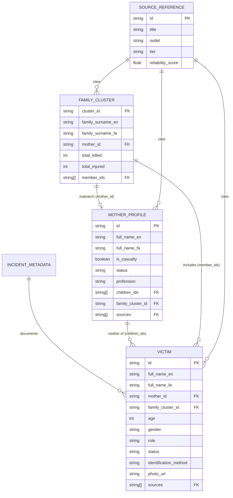

# Minab Incident Unified Data Architecture & Validation Pipeline
> **People for Peace & Justice ry (PFPJ ry)**  
> **Campaign:** Justice for Minab Children & Mothers  
> **Target:** Shajareh Tayyebeh Girls' Elementary School Airstrike (February 28, 2026)  
> **Status:** Unified Production Standard v1.0.0

---

## 1. Overview & Architectural Blueprint

This directory defines the formal data architecture for documenting casualties, bereaved mothers, affected family clusters, and evidentiary sources resulting from the airstrike on the Shajareh Tayyebeh Elementary School in Minab, Iran.

The pipeline ensures:
- Strict typing and validation across frontend (TypeScript/React), backend (Python/Django fixtures), and analytical pipelines.
- Relational integrity enforcing bidirectional mother-child linkages and family cluster casualty counts.
- Production-ready exports for legal documentation (ICTY/ECtHR benchmarks), open data portals, and interactive memorial visualizations.

---

## 2. File Directory

| File | Type | Purpose |
|------|------|---------|
| [`minab_data_model.json`](file:///Users/mahdifarimani/Documents/PFP/Campaigns/minab/data/minab_data_model.json) | JSON Schema (Draft-07) | Authoritative JSON schema defining `Victim`, `MotherProfile`, `FamilyCluster`, `SourceReference`, and `IncidentMetadata`. |
| [`minab_types.ts`](file:///Users/mahdifarimani/Documents/PFP/Campaigns/minab/data/minab_types.ts) | TypeScript Definitions | Mirror of JSON schema with strict union types, runtime type guards, CSV schema interfaces, and helper formatters. |
| [`validate_minab_data.py`](file:///Users/mahdifarimani/Documents/PFP/Campaigns/minab/data/validate_minab_data.py) | Python CLI & Engine | Deep structural & relational validator. Verifies foreign keys, bidirectional relations, casualty totals, and exports clean CSVs. |
| [`minab_incident_dataset.json`](file:///Users/mahdifarimani/Documents/PFP/Campaigns/minab/data/minab_incident_dataset.json) | Canonical Dataset | Verified dataset containing victims, mothers, family clusters, sources, and incident coordinates. |
| [`minab_csv_exporter.py`](file:///Users/mahdifarimani/Documents/PFP/Campaigns/minab/data/minab_csv_exporter.py) | Python Utility | Standalone CSV export generator producing flattened tables for GIS/Excel/analytics. |
| [`minab_web_hooks.ts`](file:///Users/mahdifarimani/Documents/PFP/Campaigns/minab/data/minab_web_hooks.ts) | React / Web Hooks | Custom hooks (`useMinabDataset`, `useEnrichedVictims`, `useVictimFilter`, `useMothersShowcase`, `useFamilyClusters`) for `PFP_Platform/web`. |
| [`minab_platform_adapter.py`](file:///Users/mahdifarimani/Documents/PFP/Campaigns/minab/data/minab_platform_adapter.py) | Backend Adapter | Converts unified incident JSON into Django fixtures for `PFP_Platform/api`. |
| `exports/` | CSV Data Tables | Flattened CSV files ready for distribution (`minab_victims.csv`, `minab_mothers.csv`, `minab_family_clusters.csv`, `minab_sources.csv`). |

---

## 3. Entity Relational Model



---

## 4. Running Validation & Export

### 1. Run Data Validation
```bash
python3 validate_minab_data.py --data minab_incident_dataset.json --schema minab_data_model.json
```

### 2. Run in Strict Mode (Fails on Warnings)
```bash
python3 validate_minab_data.py --data minab_incident_dataset.json --strict
```

### 3. Run Validation and Export CSV Tables
```bash
python3 validate_minab_data.py --data minab_incident_dataset.json --export-csv ./exports
```

### 4. CI/CD Automated JSON Output
```bash
python3 validate_minab_data.py --json
```

---

## 5. Web & Backend Platform Integration

### Frontend (`PFP_Platform/web`):
```typescript
import { useMinabDataset, useEnrichedVictims, useVictimFilter } from './minab_web_hooks';

export function MemorialGrid() {
  const { data, loading, error } = useMinabDataset();
  const enrichedVictims = useEnrichedVictims(data);
  const { filteredVictims, filters, updateFilter } = useVictimFilter(enrichedVictims);

  if (loading) return <div>Loading victim registry...</div>;

  return (
    <div className="grid grid-cols-4 gap-4">
      {filteredVictims.map((victim) => (
        <VictimCard key={victim.id} victim={victim} />
      ))}
    </div>
  );
}
```

### Backend (`PFP_Platform/api`):
```bash
# Generate Django fixtures
python3 minab_platform_adapter.py --data minab_incident_dataset.json --output minab_django_fixture.json

# Load into database
python manage.py loaddata minab_django_fixture.json
```
