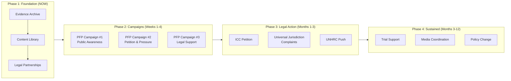
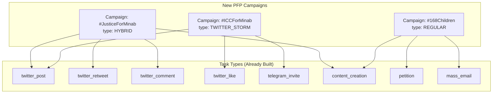
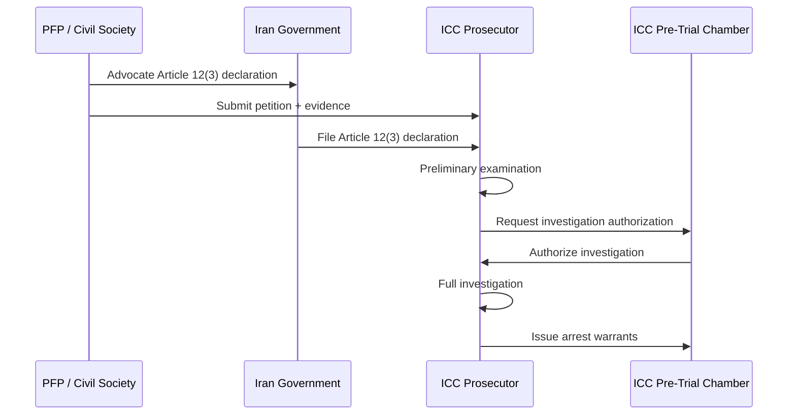

# Minab Accountability Initiative — Action Plan
## From Research to Action: A PFP-Integrated Strategy

---

## The Big Picture



---

## Phase 1: Foundation (This Week)

### 1.1 Evidence Preservation & Archive

**What we need:**
- Satellite imagery of the school (before/after strike)
- Verified victim names, ages, photos (you already have 100 from `splitted_photos/`)
- Survivor testimony collection (video/audio)
- Medical reports and casualty documentation
- Investigative journalism reports (NYT, BBC Verify, WaPo, CBC)

**Actions:**
| # | Action | Owner | Tool/Method |
|---|--------|-------|-------------|
| 1 | Create secure, redundant evidence archive | PFP Team | Encrypted cloud storage (multiple jurisdictions) |
| 2 | Finalize Minab children name verification | PFP Team | Complete `name_verification.html` — cross-ref with Iranian sources |
| 3 | Archive all media reports with timestamps | PFP Team | Wayback Machine + local copies |
| 4 | Begin collecting survivor testimonies | Need: Farsi-speaking volunteer network | Video calls, encrypted channels |

### 1.2 Legal Partnerships

**Who to contact (in priority order):**

| Organization | Why | Contact Method |
|---|---|---|
| **DAWN** (Democracy for Arab World Now) | Already advocating Article 12(3) — align efforts | [dawnmena.org](https://dawnmena.org) |
| **ECCHR** (European Center for Constitutional and Human Rights, Berlin) | Universal jurisdiction filing experience (Syria cases) | [ecchr.eu](https://ecchr.eu) |
| **Center for Justice & Accountability** (San Francisco) | ATS litigation specialists | [cja.org](https://cja.org) |
| **Human Rights Watch** | Already investigating Minab as war crime | [hrw.org](https://hrw.org) |
| **Amnesty International** | Global advocacy reach | [amnesty.org](https://amnesty.org) |
| **TRIAL International** (Geneva) | Universal jurisdiction cases | [trialinternational.org](https://trialinternational.org) |

**First meeting agenda template:**
1. Share PFP platform capabilities (Telegram bot, volunteer network, content library)
2. Discuss evidence we've collected
3. Explore formal partnership for legal filings
4. Plan joint campaign coordination

### 1.3 Content Library Build

Use the existing Minab assets to create shareable campaign content:

| Asset | Status | Next Step |
|---|---|---|
| 100 children photos | ✅ Extracted | Verify all names, create individual memorial cards |
| Farsi lyrics/song | ✅ Written | Record, produce, distribute |
| Arabic lyrics/song | ✅ Written | Record, produce, distribute |
| Interactive mosaic | ✅ Built | Deploy to peopleforpeace.live |
| Countdown cards | ✅ Created | Schedule for social media release |
| Spotlight cards | ✅ Created | Use in Twitter campaigns |

---

## Phase 2: PFP Platform Campaigns (Weeks 1-4)

### How This Maps to PFP's Architecture

The existing PFP system already has everything needed. Here's the mapping:



### Campaign #1: `#JusticeForMinab` (Awareness)

**Campaign settings:**
```
Name: Justice for Minab
Name (FA): عدالت برای مینابbf
Name (AR): العدالة لأطفال میناب
Type: HYBRID
Target Members: 1000
Target Activities: 5000
Hashtags: #JusticeForMinab, #MinabSchoolMassacre, #168Children, #TrumpWarCrimes
Mentions: @IntlCrimCourt, @UNHumanRights, @hraborowitz, @KashmirViolence
```

**Tasks to create:**

| # | Type | Title | Description | Points |
|---|---|---|---|---|
| 1 | `twitter_post` | Share a child's story | Post a spotlight card with one child's name and photo | 15 |
| 2 | `twitter_comment` | Comment on key tweets | Reply to US officials/media with Minab facts | 10 |
| 3 | `twitter_retweet` | Amplify investigative reports | RT NYT/BBC/WaPo reports on Minab | 5 |
| 4 | `content_creation` | Create original content | Make your own video/post about Minab | 25 |
| 5 | `telegram_invite` | Grow the movement | Invite friends to the PFP bot | 20 |

**Sample tweets (for `twitter_post` task):**
1. *"Her name was Zahra Sharafi. She was in school when a US missile hit. She was 9 years old. #JusticeForMinab #168Children"*
2. *"168 children killed in Minab. The US military admits it was a 'targeting error.' This is not an error — it's a war crime. #JusticeForMinab"*
3. *"The ICC must investigate the Minab school massacre. Iran should invoke Article 12(3) of the Rome Statute. #ICCForMinab"*

### Campaign #2: `#ICCForMinab` (Legal Pressure)

**Purpose:** Direct pressure on institutions to investigate.

**Tasks:**

| # | Type | Title | Description | Points |
|---|---|---|---|---|
| 1 | `petition` | Sign the ICC petition | Sign the 100+ world leaders petition demanding ICC investigation | 10 |
| 2 | `mass_email` | Email your representative | Send template email to your senator/MP demanding accountability | 20 |
| 3 | `twitter_post` | Tag the ICC Prosecutor | Tweet directly @IntlCrimCourt demanding investigation | 15 |
| 4 | `twitter_comment` | Reply to senators | Comment on Sen. Baldwin and others who support investigation | 10 |

**Email template for `mass_email` task:**
```
Subject: Demand ICC Investigation into Minab School Strike

Dear [Representative],

On February 28, 2026, a US military strike destroyed the Shajareh
Tayyebeh Girls' Elementary School in Minab, Iran, killing at least
168 people — primarily schoolgirls aged 7-12.

The US military's own preliminary investigation concluded this was
a targeting error based on outdated intelligence. Human Rights Watch
has called for this to be investigated as a war crime.

I urge you to:
1. Support a full, independent investigation
2. Demand the Pentagon release the complete targeting chain
3. Support ICC jurisdiction to investigate this incident

[Name]
```

### Campaign #3: `#168Children` (Memorial & Sustained)

**Purpose:** Don't let the world forget. Keep the names alive.

**Tasks:**

| # | Type | Title | Description | Points |
|---|---|---|---|---|
| 1 | `content_creation` | Name one child per day | Post a memorial for one of the 168 children daily | 20 |
| 2 | `twitter_post` | 168 days, 168 names | Part of a coordinated 168-day naming campaign | 15 |
| 3 | `telegram_invite` | Build the memorial network | Invite people to join the memorial campaign | 20 |

### Twitter Storm Schedule

Use the existing `TwitterStorm` model to schedule coordinated storm events:

| Storm | Date | Trigger | Hashtag |
|---|---|---|---|
| Storm #1 | Mar 28 (1-month anniversary) | Anniversary | #OneMonthMinab |
| Storm #2 | When ICC makes a statement | Reactive | #ICCForMinab |
| Storm #3 | Next UN session on Iran | Political moment | #UNInvestigateMinab |
| Storm #4 | Feb 28, 2027 (1-year anniversary) | Anniversary | #MinabNeverForget |

---

## Phase 3: Legal Action (Months 1-3)

### 3.1 ICC Pathway



**PFP's role:**
1. **Phase 3a**: Petition Iran (through diaspora networks, DAWN partnership)
2. **Phase 3b**: Submit evidence package to ICC Office of the Prosecutor
3. **Phase 3c**: Support with victim testimony coordination
4. **Phase 3d**: Public pressure to maintain political will

### 3.2 Universal Jurisdiction Filings

**Target jurisdiction: Germany**
- Germany's Code of Crimes Against International Law (Völkerstrafgesetzbuch) allows prosecution of international crimes with no territorial connection.
- ECCHR has successfully used this for Syrian officials.
- **Action**: File criminal complaint with German Federal Prosecutor (Generalbundesanwalt).

**Filing timeline:**
1. **Month 1**: Engage ECCHR, prepare complaint
2. **Month 2**: Submit complaint with evidence package
3. **Month 3+**: Support investigation as needed

### 3.3 UNHRC Commission of Inquiry

**Action**: Campaign for UN Human Rights Council to establish a Commission of Inquiry.
- **Task for PFP volunteers**: Mass-email campaign targeting UNHRC member states
- **Goal**: 47 member states — need majority to vote for COI

---

## Phase 4: Sustained Pressure (Months 3-12)

| Activity | Frequency | PFP Task Type |
|---|---|---|
| Child memorial posts | Daily (168-day cycle) | `content_creation` |
| Senator pressure emails | Weekly | `mass_email` |
| ICC update tweets | As news breaks | `twitter_post` |
| Coordinated storms | Monthly + reactive | Twitter Storm |
| Evidence updates to ICC | As available | Admin |

---

## What We Need — Resource Checklist

### People

| Role | Why | Priority | Status |
|---|---|---|---|
| International law attorney | Legal strategy, ICC filing | 🔴 Critical | Needed — contact ECCHR/CJA |
| Farsi-speaking volunteer coordinator | Survivor testimony, Iran advocacy | 🔴 Critical | Needed |
| Arabic-speaking content creator | Arabic campaign content | 🟠 High | Partial (lyrics exist) |
| Social media manager | Campaign scheduling, storm coordination | 🟠 High | Needed |
| Video editor/producer | Memorial videos, songs | 🟡 Medium | Needed for song production |
| Graphic designer | Campaign visuals, spotlight cards | 🟡 Medium | Partially automated |

### Financial

| Item | Estimated Cost | Notes |
|---|---|---|
| Legal consultation (ECCHR/CJA) | $0 (pro bono expected) | Human rights orgs often work pro bono |
| ICC filing support | $5K–$20K | Legal research, translation |
| Song production (Farsi + Arabic) | $2K–$5K | Studio time, musicians |
| PFP platform hosting | Already covered | SkinScope server |
| Content creation tools | ~$500/year | Design subscriptions |

### Technical (PFP Platform)

| Feature | Effort | Already Built? |
|---|---|---|
| New campaigns in Django Admin | XS | ✅ Yes — just create via admin |
| New tasks per campaign | XS | ✅ Yes — Django admin |
| Twitter Storm scheduling | S | ✅ Yes — `TwitterStorm` model exists |
| Petition task type | XS | ✅ Yes — `petition` type exists |
| Mass email task type | XS | ✅ Yes — `mass_email` type exists |
| Content creation with Minab library | M | ⚠️ Partially — needs media library integration |
| Memorial page on website | M | ❌ New feature — interactive mosaic on peopleforpeace.live |
| Evidence submission portal | L | ❌ New feature — secure upload for survivor testimony |

---

## Immediate Next Steps (This Week)

| # | Action | Effort | Who |
|---|---|---|---|
| 1 | **Finalize all 100 children names** via `name_verification.html` | S | PFP Team |
| 2 | **Create Campaign #1** (`#JusticeForMinab`) in Django Admin with 5 tasks | XS | Admin |
| 3 | **Draft outreach email** to DAWN + ECCHR | S | PFP Lead |
| 4 | **Deploy interactive mosaic** to peopleforpeace.live | M | Dev |
| 5 | **Prepare ICC evidence package** (photos, names, media links) | M | PFP Team |
| 6 | **Schedule first Twitter Storm** for March 28 (1-month anniversary) | XS | Admin |
| 7 | **Record Farsi + Arabic songs** (lyrics already written) | L | External |

---

## Risk Assessment

| Risk | Mitigation |
|---|---|
| US sanctions/pressure on collaborators | Operate from multiple jurisdictions, use encrypted comms |
| Evidence destruction | Redundant archives, Wayback Machine, blockchain timestamps |
| Volunteer burnout | Gamified system (points, leaderboard) already built — maintain engagement |
| Legal dead-ends | Pursue all 10 approaches simultaneously — some will progress |
| Platform censorship (Twitter/X bans) | Diversify: Telegram, Mastodon, Instagram, Threads |
| Iran refuses to file Article 12(3) | Fall back to universal jurisdiction + UNHRC route |

---

> [!IMPORTANT]
> **The platform is ready. The content exists. The legal pathways are mapped.** The missing piece is **activation** — creating the campaigns, forming the partnerships, and launching the first coordinated push. The 1-month anniversary (March 28) is a natural starting point.

*Action plan created: March 13, 2026*
