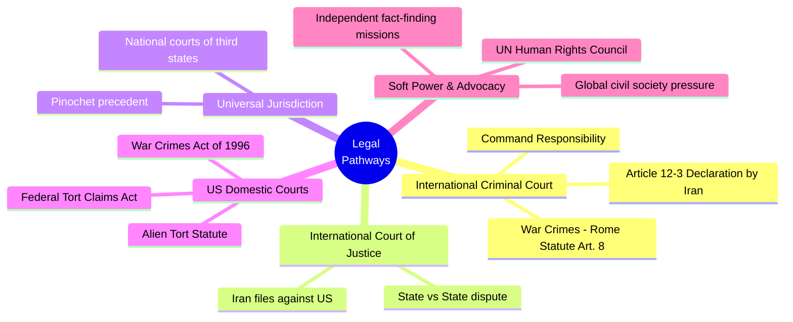

# Legal Accountability for the Minab School Strike
## Comprehensive Research & Strategy Brainstorm

---

## 1. The Incident: Key Facts

| Detail | Information |
|---|---|
| **Date** | February 28, 2026 (Day 1 of the US-Iran war) |
| **Location** | Shajareh Tayyebeh Girls' Elementary School, Minab, Hormozgan Province, Iran |
| **Casualties** | **168–180 killed** (primarily schoolgirls aged 7–12), ~95 injured |
| **Children killed** | At least **108 children** confirmed |
| **Responsibility** | Preliminary US military investigation concluded the US was likely responsible |
| **Cause** | Targeting error — school misidentified as part of adjacent IRGC naval base due to **outdated intelligence data** |
| **Verified by** | NYT, CBC, NPR, BBC Verify, Washington Post, HRW |
| **Trump's response** | Initially blamed Iran; later said he was "unaware" of preliminary findings |

> [!CAUTION]
> This is one of the **deadliest civilian casualty events** in decades of US conflicts. UNESCO classified it as a **grave violation of humanitarian law**.

---

## 2. Legal Framework Overview

---

## 3. Ten Approaches to Legal Accountability

### Approach 1: ICC via Iran's Article 12(3) Declaration
**Viability: ⭐⭐⭐⭐ (High)**

> [!IMPORTANT]
> This is the **most viable international criminal pathway** and already advocated by DAWN.

- **Mechanism**: Iran (non-ICC member) files an ad hoc declaration under **Rome Statute Article 12(3)**, accepting ICC jurisdiction over crimes committed on its territory since Feb 28, 2026.
- **Precedent**: Palestine (2014) and Ukraine (twice) have successfully used this mechanism.
- **Charges**: War crimes under **Article 8** — intentional attacks on civilian objects (schools), disproportionate attacks.
- **Target**: Individual US officials in the chain of command, potentially including Trump as Commander-in-Chief.

**Challenges**:
- US is not an ICC member and actively obstructs ICC (Trump previously sanctioned ICC officials).
- *Mens rea* issue: EJIL analysis notes the Rome Statute requires **intent or knowledge** — a "subjectively honest mistake" could negate the mental element.
- Enforcement: Even with ICC prosecution, arrest and extradition of US nationals is politically near-impossible.

**What we can do**:
1. **Lobby Iran's government** to file the Article 12(3) declaration immediately.
2. **Support DAWN's campaign** — amplify their public calls.
3. **Petition the ICC Prosecutor directly** (100+ world leaders have already done this).
4. **Compile and preserve evidence** — satellite imagery, survivor testimony, photos of victims.

---

### Approach 2: Command Responsibility Doctrine
**Viability: ⭐⭐⭐ (Medium)**

- **Doctrine**: Commanders (including heads of state) are liable if they:
  1. Had a superior-subordinate relationship with perpetrators
  2. **Knew or should have known** crimes were being committed
  3. **Failed to prevent or punish** the crimes
- **Applicability**: Trump as Commander-in-Chief bears ultimate authority. The question is whether he ordered/approved the strike, was briefed, or failed to ensure proper targeting protocols.
- **Precedent**: *In re Yamashita* — US Supreme Court applied command responsibility to Japanese general.

**Key argument**: Even if Trump didn't personally order the Minab strike, if the targeting process was **systemically flawed** (outdated intelligence, AI targeting without human review), the President bears command responsibility for institutional failures.

**What we can do**:
1. Demand **full disclosure of the targeting chain** — who approved the strike? Was AI involved?
2. Investigate whether Trump **rolled back civilian protection protocols** (he revoked Obama-era transparency rules per Brookings/ProPublica reporting).
3. Build the case that **systemic negligence** constitutes the "should have known" standard.

---

### Approach 3: Universal Jurisdiction Prosecution
**Viability: ⭐⭐⭐ (Medium)**

- **Mechanism**: National courts in third countries prosecute individuals for war crimes regardless of where the crime occurred or the nationality of the accused.
- **Key precedent**: *R v. Pinochet* — UK courts ruled that a former head of state cannot claim immunity for international crimes (torture) committed while in office.
- **ICC al-Bashir ruling (2019)**: Customary international law permits arresting a sitting head of state for atrocity crimes.

**Most promising jurisdictions**:
| Country | Why |
|---|---|
| **Germany** | Strong universal jurisdiction laws; prosecuted Syrian officials |
| **Belgium** | Historically aggressive universal jurisdiction |
| **Spain** | Pinochet arrest originated here |
| **Netherlands** | Home of ICC; strong rule-of-law tradition |
| **Argentina** | Has investigated Franco-era Spanish crimes |

**Challenges**:
- Sitting heads of state retain **personal immunity** in foreign courts while in office.
- Once Trump leaves office, immunity for international crimes **ceases** (per Pinochet/EJIL precedent).
- Political will from third states is required — US diplomatic pressure would be immense.

**What we can do**:
1. File **criminal complaints in Germany** (Code of Crimes against International Law) and other jurisdictions.
2. **Time this for after Trump leaves office** — personal immunity no longer applies.
3. Build coalitions with **European NGOs** (ECCHR, TRIAL International) who have experience filing universal jurisdiction cases.

---

### Approach 4: ICJ State-vs-State Case
**Viability: ⭐⭐⭐⭐ (High for state accountability, not individual)**

- **Mechanism**: Iran files a case at the ICJ against the United States for violations of international law.
- **Existing precedent**: Iran already has a pending case (*Certain Iranian Assets*) at the ICJ against the US.
- **Jurisdiction**: The ICJ can adjudicate disputes between states regarding treaty obligations and customary international law.

**Potential legal bases**:
- Violation of the **1949 Geneva Conventions** (protection of civilians).
- Violation of **customary international humanitarian law** (proportionality, distinction, precaution in attack).
- Violation of the **UN Charter** preamble and articles on use of force.

**Limitation**: The ICJ doesn't prosecute individuals — it would hold the **US as a state** accountable, not Trump personally. However, an ICJ ruling condemning the US would create powerful legal and moral precedent.

**What we can do**:
1. Advocate for Iran to file an ICJ application with a **request for provisional measures**.
2. Support legal teams preparing the ICJ submission with **evidence and witness testimony**.

---

### Approach 5: US Domestic Criminal Prosecution
**Viability: ⭐⭐ (Low under current administration)**

- **War Crimes Act of 1996** (18 U.S.C. § 2441): Makes it a federal crime for US nationals to commit war crimes.
- **UCMJ**: Military personnel can be court-martialed for laws-of-war violations.
- **2022 Amendment**: Strengthened the War Crimes Act to allow prosecution of anyone present on US territory suspected of war crimes.

**The problem**: Prosecution requires **DOJ/political will**. While Trump is in office, DOJ prosecution against the Commander-in-Chief is constitutionally and practically impossible. Even after leaving office, political appetite would be minimal.

**What we can do**:
1. Build the **evidentiary record now** for future prosecution.
2. **Congressional pressure**: Support senators (like Tammy Baldwin) demanding DOD accountability.
3. Push for a **Special Counsel** appointment if political winds shift.

---

### Approach 6: Alien Tort Statute (ATS) Civil Lawsuit
**Viability: ⭐⭐ (Low)**

- **Mechanism**: Foreign nationals can sue in US federal courts for torts committed in violation of international law.
- **Major limitation**: *Kiobel v. Royal Dutch Petroleum* (2013) established a **presumption against extraterritoriality** — claims must "touch and concern" the US with "sufficient force."

**Arguments for overcoming Kiobel**:
- The targeting decisions were made **on US soil** (CENTCOM/Pentagon).
- US military personnel carried out the strike using **US military assets**.
- This distinguishes it from Kiobel (which involved conduct by foreign corporations abroad).

**Challenges**:
- Head-of-state immunity would protect Trump while in office.
- **Sovereign immunity** / political question doctrine could bar claims against the government.
- FTCA's **foreign-country exception** bars tort claims "arising in a foreign country."

**What we can do**:
1. Engage **human rights litigation organizations** (EarthRights International, Center for Justice and Accountability) to explore ATS filing.
2. Identify specific US-based decision-makers in the targeting chain as defendants.
3. File after Trump leaves office to avoid personal immunity.

---

### Approach 7: UN Human Rights Council Investigation
**Viability: ⭐⭐⭐⭐⭐ (High for fact-finding, low for enforcement)**

- **Mechanism**: The UNHRC can establish a **Commission of Inquiry (COI)** or **Independent International Fact-Finding Mission**.
- UN experts have already condemned the attack — this builds on existing momentum.
- COI reports are **legally significant** and can be used as evidence in ICC, ICJ, and national court proceedings.

**What we can do**:
1. Campaign for a **UNHRC special session** on the Minab attack.
2. Support the appointment of a **Special Rapporteur** on the Iran conflict.
3. Ensure COI findings are preserved for future legal proceedings.

---

### Approach 8: Gordon Brown's Proposed International Criminal Court for Crimes Against Children
**Viability: ⭐⭐ (Long-term, aspirational)**

- Former UK PM Gordon Brown has proposed a **dedicated international court for crimes against children**, citing Minab specifically.
- While existing international law already protects children and schools, a specialized court would have a narrower mandate and could build stronger jurisprudence.

**What we can do**:
1. Amplify Brown's proposal in international media and diplomatic forums.
2. Frame Minab as the **founding case** for such a court.
3. Use the proposal to keep international attention on the incident.

---

### Approach 9: Civil Society & Public Pressure Campaign
**Viability: ⭐⭐⭐⭐⭐ (Highest immediate impact)**

> [!TIP]
> This approach **enables all other approaches**. Without public pressure, no legal mechanism will be pursued.

- **Coalition of 100+ world leaders & Nobel laureates** have already petitioned the ICC.
- **People for Peace (PFP)** platform is already building awareness tools (children's names, photos, music).

**What we can do**:
1. **Name every child** — humanize the victims (you already have 100 children identified with photos).
2. **Social media campaigns** with verified names, faces, and stories.
3. **Documentary evidence** — preserve satellite imagery, survivor testimony, medical records.
4. **Partner with established human rights orgs**: HRW, Amnesty, DAWN, ECCHR.
5. **Use the PFP platform** to coordinate global advocacy and task volunteers.
6. **Organize vigils and protests** at US embassies and international institutions.
7. **Engage diaspora communities** and legal professionals.

---

### Approach 10: Targeted Sanctions & Travel Bans
**Viability: ⭐⭐⭐ (Medium, requires allied states)**

- **Mechanism**: States or international bodies impose targeted sanctions (asset freezes, travel bans) on individuals responsible for the Minab strike.
- **Precedent**: EU Magnitsky-style sanctions for human rights violations.

**What we can do**:
1. Petition **EU member states** to impose targeted sanctions on military officials in the chain of command.
2. Seek **Magnitsky Act designations** (ironic, since it's a US law — but other countries have equivalent legislation).
3. Travel ban enforcement — if US officials responsible travel to ICC member states, seek their arrest.

---

## 4. Strategic Prioritization

| Priority | Approach | Timeline | Impact |
|---|---|---|---|
| 🔴 **Immediate** | Civil society pressure campaign (Approach 9) | Now | Enables everything else |
| 🔴 **Immediate** | Push Iran to file Article 12(3) declaration (Approach 1) | Now | Opens ICC jurisdiction |
| 🟠 **Short-term** | UNHRC investigation (Approach 7) | Weeks | Creates evidentiary record |
| 🟠 **Short-term** | ICJ state-vs-state case (Approach 4) | Months | International legal precedent |
| 🟡 **Medium-term** | Universal jurisdiction complaints (Approach 3) | Months–Years | Post-office prosecution |
| 🟡 **Medium-term** | Command responsibility case-building (Approach 2) | Ongoing | Supports all legal avenues |
| 🔵 **Long-term** | ATS lawsuit (Approach 6) | Post-presidency | Civil damages |
| 🔵 **Long-term** | US domestic prosecution (Approach 5) | Post-presidency | Requires political shift |
| ⚪ **Aspirational** | Children's crimes court (Approach 8) | Years | Systemic change |

---

## 5. Key Legal Challenges to Anticipate

### The "Honest Mistake" Defense
The US military framing this as a "targeting error" based on "outdated intelligence" is a deliberate strategy to avoid the *mens rea* (criminal intent) required for war crimes prosecution. 

**Counter-arguments**:
- Gross negligence in failing to verify a target (a **school full of children**) is not an "honest mistake" — it's **reckless disregard** for civilian life.
- The **precautionary principle** in IHL requires attackers to do "everything feasible" to verify targets. Using **outdated data** violates this obligation.
- If **AI tools** were used in targeting, the decision to rely on automated systems without adequate human oversight itself constitutes negligence.

### Head of State Immunity
- **While in office**: Trump has personal immunity from foreign criminal jurisdiction.
- **After leaving office**: Immunity ceases for international crimes (Pinochet precedent, EJIL, ICC al-Bashir ruling).
- **Strategy**: Build the case now, execute prosecutions after Trump's term ends.

### US Obstruction
- The US has historically sanctioned ICC officials, refused ICC jurisdiction, and pressured allies not to cooperate.
- **Counter-strategy**: Build a broad enough international coalition that US obstruction becomes diplomatically costly.

---

## 6. Immediate Action Items for PFP

- [ ] **Evidence preservation**: Ensure all evidence (photos, names, satellite imagery, witness accounts) is archived securely and backed up in multiple jurisdictions.
- [ ] **Legal consultation**: Engage with ECCHR (Berlin), Center for Justice and Accountability (SF), and DAWN (DC) for legal strategy.
- [ ] **Iran advocacy**: Through diplomatic channels, encourage Iran to file Article 12(3) declaration and ICJ application.
- [ ] **Congressional allies**: Support US senators pushing for DOD accountability (Tammy Baldwin et al.).
- [ ] **Media strategy**: Coordinate with investigative journalists who have verified the strike (NYT, BBC, WaPo).
- [ ] **Petition ICC**: Join the 100+ world leaders coalition petitioning the ICC Prosecutor.
- [ ] **Universal jurisdiction filings**: Prepare criminal complaints for filing in Germany and other jurisdictions.
- [ ] **PFP platform campaigns**: Launch targeted campaigns using children's verified names and stories.

---

> [!NOTE]
> **Disclaimer**: This document is a research and strategy brainstorm, not legal advice. Any legal action should be undertaken in consultation with qualified international law practitioners.

*Research compiled: March 13, 2026*
