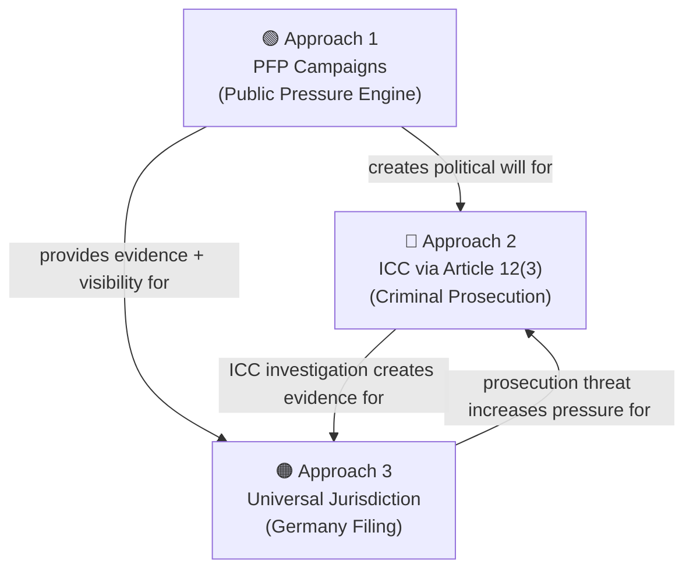
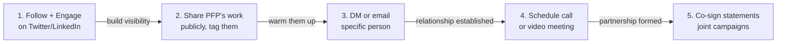

# Justice for Minab — Top 3 Strategy
## Focused, High-Impact Approaches

---

## Why Only 3?

Spreading across 10 legal avenues sounds thorough, but it dilutes energy and confuses the message. These 3 approaches were selected because they:
1. **Reinforce each other** — progress in one unlocks the others
2. **Match PFP's capabilities** — volunteer coordination, content creation, digital pressure
3. **Have the highest probability of real outcomes**

---

## Approach 1: PFP Public Pressure Engine
**Role: The force multiplier that makes everything else possible**

> Without public pressure, no prosecutor will act, no government will file declarations, and no court will issue warrants. PFP IS the engine.

### Why this is #1
- ICC prosecutors don't investigate without political will
- Iran won't file Article 12(3) without international pressure
- German prosecutors need to see public demand
- Media attention sustains all legal efforts

### Concrete Actions

| Week | Campaign | Key Actions |
|---|---|---|
| **Week 1** (Now) | Setup | Create `#JusticeForMinab` campaign in Django Admin, prep content library |
| **Week 2** | Launch | Activate campaign, first wave of Twitter tasks, deploy memorial page |
| **Week 3** (Mar 28) | **1-Month Anniversary Storm** | Coordinated TwitterStorm, global vigils, media push |
| **Week 4+** | Sustained | Daily child memorials (168-day cycle), weekly pressure emails |

### What PFP Volunteers Do

**Daily tasks** (via Telegram bot):
- Share a child's spotlight card → `twitter_post` (15 pts)
- Comment on official statements demanding investigation → `twitter_comment` (10 pts)
- Amplify investigative journalism → `twitter_retweet` (5 pts)
- Invite new activists → `telegram_invite` (20 pts)

**Weekly tasks**:
- Email representatives demanding investigation → `mass_email` (20 pts)
- Create original content (videos, threads, art) → `content_creation` (25 pts)

**Monthly events**:
- Coordinated Twitter Storms on anniversaries/news moments
- Sign/share petitions → `petition` (10 pts)

---

## Approach 2: ICC via Iran's Article 12(3) Declaration
**Role: The formal criminal prosecution pathway**

### Why this is #2
- **Most established mechanism** for non-ICC-member states (precedent: Palestine, Ukraine)
- DAWN (a credible DC-based org) is already pushing this — we join, not start from scratch
- A coalition of 100+ world leaders and Nobel laureates has already petitioned the ICC
- If successful, **individual arrest warrants** can be issued

### How It Works

1. **Iran** files an Article 12(3) declaration with the ICC → accepts jurisdiction for crimes on its territory since Feb 28, 2026
2. **ICC Prosecutor** opens a preliminary examination
3. ICC Prosecutor requests Pre-Trial Chamber authorization for a **full investigation**
4. Investigation → evidence collection → **arrest warrants** against individuals in the chain of command

### PFP's Role (We're Not Lawyers — We're the Pressure)

| Action | Method | Owner |
|---|---|---|
| **Amplify DAWN's campaign** | Social media, share their petition, co-sign statements | PFP volunteers |
| **Petition ICC Prosecutor directly** | Join the 100+ world leaders petition, add PFP's voice | PFP Lead |
| **Pressure Iran to act** | Diaspora networks, media advocacy, Farsi-language campaigns | PFP + partners |
| **Submit evidence** | Provide victim names/photos/testimony to ICC and DAWN | PFP Team |
| **Keep it visible** | If ICC acts, amplify massively. If ICC stalls, pressure more | PFP campaigns |

### Key Partnership: DAWN
- They have the legal expertise and DC connections
- We have the volunteer army and content library
- **Complementary strengths** — this isn't cold outreach, it's a force multiplier

---

## Approach 3: Universal Jurisdiction (Germany)
**Role: The contingency that works even if ICC/Iran don't act**

### Why Germany?
- Germany's **Völkerstrafgesetzbuch** (Code of Crimes Against International Law) allows prosecution with **zero territorial connection**
- Germany's Federal Prosecutor has **successfully prosecuted Syrian officials** for war crimes — proven track record
- **ECCHR** (European Center for Constitutional and Human Rights, Berlin) has filed these cases before and accepts partner submissions
- Unlike ICC, this doesn't require Iran's cooperation

### How It Works

1. **Criminal complaint** filed with the Generalbundesanwalt (Federal Prosecutor) in Karlsruhe
2. Prosecutor evaluates → may open a **structural investigation**
3. Evidence collection (this is where PFP's archive matters)
4. If suspects travel to Germany/EU → **arrest**
5. Post-presidency: head-of-state immunity **no longer applies** (Pinochet precedent)

### Timeline

| Phase | When | Action |
|---|---|---|
| Prep | Now – Month 2 | Build evidence package, contact ECCHR |
| Filing | Month 2-3 | Submit criminal complaint |
| Investigation | Month 3-12+ | Support prosecutor with evidence, witnesses |
| Prosecution | Post-Trump presidency | Immunity removed, enforcement possible |

### PFP's Role

| Action | Method |
|---|---|
| **Contact ECCHR** | Formal partnership request (see outreach below) |
| **Build evidence archive** | Names, photos, satellite imagery, media reports |
| **Witness coordination** | Connect diaspora witnesses with legal team |
| **Public visibility** | Campaign to make the German filing known globally |

---

## Outreach Strategy: Email vs. What?

### Honest Assessment of Cold Emails

| Approach | Effectiveness | Why |
|---|---|---|
| Cold email to generic inbox | ⭐ (20%) | Gets buried, no relationship, no trust |
| Email to specific person with referral | ⭐⭐⭐⭐ (70%) | Personal, targeted, warm intro |
| Twitter/LinkedIn public engagement first | ⭐⭐⭐ (60%) | Builds visibility before asking |
| Conference/event networking | ⭐⭐⭐⭐⭐ (90%) | Face-to-face, shows commitment |
| **Showing up with something built** | ⭐⭐⭐⭐⭐ (90%) | You're not asking — you're offering |

### Recommended Multi-Channel Strategy

**The key insight**: Don't just email asking for help. **Show them what you've already built** — the platform, the volunteer network, the 100 children's photos/names, the songs. Come as a partner with assets, not a petitioner with needs.

### Step-by-Step Outreach Plan

**Week 1: Digital presence (before any emails)**
1. Follow DAWN, ECCHR, CJA, HRW on Twitter/X
2. Share + quote-tweet their Minab-related posts, adding PFP's perspective
3. Post PFP's work (spotlight cards, mosaic, child names) and tag them

**Week 2: Direct outreach**
1. DM key individuals on Twitter/LinkedIn with a brief message
2. Send tailored emails (see drafts below)
3. Fill out any intake forms on their websites

**Week 3: Follow-up**
1. If no response, follow up once via different channel
2. If response, schedule video call immediately
3. Prepare a short deck showing PFP's capabilities + assets

---

## Outreach Messages

### For DAWN — Twitter DM (First Contact)

> Hi — I lead People for Peace (@peopleforpeacebot), a Telegram-based activist platform. We've been documenting the Minab children — verified names, photos, memorial content for all 100 identified victims.
> 
> We saw your Article 12(3) advocacy and want to support it. We have a volunteer network + campaign platform ready to amplify. Can we chat briefly?

### For DAWN — Follow-Up Email

**To**: contact@dawnmena.org + specific person if identified  
**Subject**: PFP Platform — Supporting Your Article 12(3) Advocacy for Minab

---

Dear DAWN Team,

I'm reaching out from **People for Peace** (peopleforpeace.live), a digital activism platform focused on the Minab school massacre.

**What we've built:**
- A Telegram bot (@peopleforpeacebot) coordinating volunteer activists with gamified tasks
- A verified database of **100 identified children** killed in the Minab strike — names, photos, ages
- Campaign content: memorial cards, an interactive mosaic, original songs in Farsi and Arabic
- Infrastructure for coordinated Twitter storms, petition drives, and mass-email campaigns

**Why we're reaching out:**
We strongly support your call for Iran to invoke Article 12(3) of the Rome Statute. We want to put our platform and volunteer network behind this effort.

**What we're offering:**
1. Amplification of your Article 12(3) campaign through our activist network
2. Our evidence archive (children's identities, media documentation) for ICC submissions
3. Coordinated social media pressure targeting ICC and Iranian diplomatic channels

We'd welcome a brief call to discuss how we can collaborate. We're not asking you to do more — we want to multiply what you're already doing.

Best regards,  
[Your Name]  
People for Peace  
peopleforpeace.live

---

### For ECCHR — Twitter DM (First Contact)

> Hi ECCHR team — People for Peace here. We've been documenting the Minab school massacre victims (100 children identified with photos/names). We want to explore filing a criminal complaint under German universal jurisdiction, similar to your Syria work. We have evidence + a volunteer network. Would you be open to a brief call?

### For ECCHR — Follow-Up Email

**To**: info@ecchr.eu + program-specific contact  
**Subject**: Criminal Complaint Under Völkerstrafgesetzbuch — Minab School Strike

---

Dear ECCHR Team,

I'm writing from **People for Peace**, a digital activism platform documenting the February 28, 2026 missile strike on the Shajareh Tayyebeh Girls' Elementary School in Minab, Iran.

**The case in brief:**
- 168+ killed, primarily schoolgirls aged 7-12
- US military's own investigation concluded it was a targeting error from outdated intelligence
- HRW has called for investigation as a war crime
- Multiple independent media verifications (NYT, BBC Verify, Washington Post)

**What we bring:**
- Verified identities of **100 children** killed (photos, names, ages)
- Comprehensive media documentation archive
- A volunteer network for witness identification in the Iranian diaspora
- A digital platform capable of coordinating evidence collection

**Our request:**
We would like to explore filing a criminal complaint with the German Federal Prosecutor under the Code of Crimes Against International Law (Völkerstrafgesetzbuch), similar to your successful work on Syrian cases. We understand the legal complexities — particularly regarding command responsibility and head-of-state immunity timelines — but believe the evidentiary basis is strong.

We'd greatly value a conversation about feasibility and next steps.

Best regards,  
[Your Name]  
People for Peace  
peopleforpeace.live

---

### For HRW — Brief Email (Supporting Role)

**To**: hrwpress@hrw.org + Middle East division contact  
**Subject**: PFP Minab Evidence Archive — Available for Your Investigation

---

Dear HRW Middle East Team,

People for Peace has compiled a verified archive of **100 identified children** killed in the Minab school strike, including photos, names, and cross-referenced source data.

We understand you're investigating this as a potential war crime. Our archive is available to support your documentation efforts. We can also assist with diaspora witness connections through our Farsi-speaking volunteer network.

Please let us know if this would be useful to your investigation.

Best regards,  
[Your Name]  
People for Peace

---

## Summary: The 3-Approach Flywheel

| # | Approach | PFP's Role | Success Metric |
|---|---|---|---|
| 1 | **PFP Campaigns** | Lead — we run this | 1000+ volunteers, sustained media attention |
| 2 | **ICC (Article 12(3))** | Support DAWN — amplify + evidence | Iran files declaration, ICC opens examination |
| 3 | **Germany (Universal Jurisdiction)** | Partner ECCHR — file complaint | Criminal complaint accepted by Generalbundesanwalt |

Each approach feeds the others. Public pressure (1) creates political will for ICC (2) and provides evidence for Germany (3). ICC investigations (2) produce evidence for Germany (3). German prosecution threats (3) increase pressure for ICC action (2).

**Start with what you control (1), then leverage it for partnerships (2 + 3).**

*Strategy document created: March 13, 2026*
